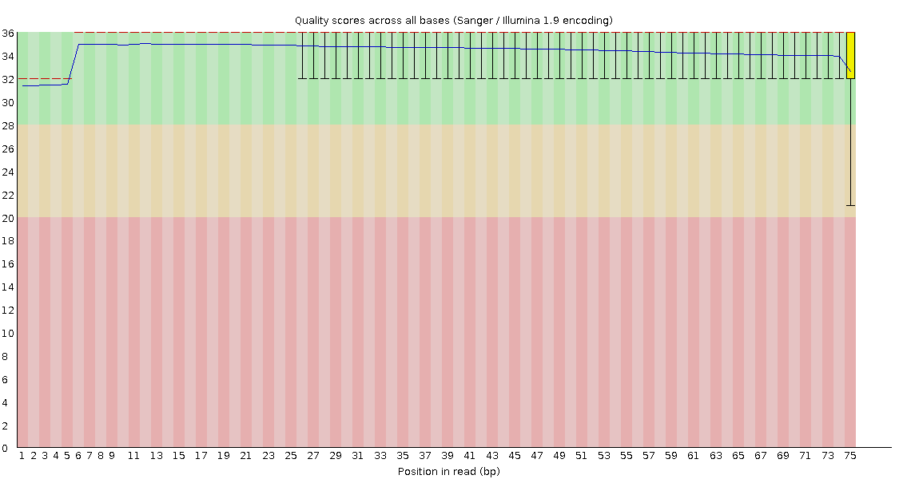

# Session 4 — Preprocessing & Quantification

Session 4 takes four chr5-only single-end FASTQ files (SKMel147 ARID2 WT and KO,
two replicates each — ~1.1–1.6 M reads apiece) all the way from raw reads to a
one-page interactive QC report. Every canonical bulk RNA-seq tool is here:
FastQC → TrimGalore → STAR → featureCounts, samtools, bamCoverage, Qualimap →
Salmon → MultiQC. On a reserved Minerva compute node the whole script runs in
about 5 minutes end-to-end (the last recorded wall-clock was **265 s**), which
is small enough to step through interactively while reading each Explore-output
block.

## Setup

Interactive shell on a Minerva compute node (grab one via OnDemand using the
session reservation):

```bash
cd /sc/arion/projects/BiNGS_bulk/${USER}/hands_on
```

To run the whole session:

```bash
bash code_rna/session_04_preprocessing.sh
```

or step through it interactively section by section (each `Section` header in
the script is self-contained — you can copy-paste a block into your shell
without breaking the ones that follow).

---

## Section 1 — Environment

Defines every path the rest of the script uses. Each variable is a named
location that would otherwise be repeated dozens of times. `ref_dir="$(pwd)"`
assumes you are running from your own `hands_on/` clone, so every output lands
under `data_rna/reduced_chr5/preprocessed/<tool>/`.

```bash
ref_dir="$(pwd)"
annotation_dir="${ref_dir}/engine/annotation"
fastq_dir="${ref_dir}/data_rna/reduced_chr5/raw/fastq"   # chr5 fastqs
code_dir="${ref_dir}/code_rna"
data_dir="${ref_dir}/data_rna"

preprocessed_dir="${data_dir}/reduced_chr5/preprocessed"

# One dir per tool under preprocessed/ — keeps outputs tidy and makes
# MultiQC's job trivial later.
fastqc_dir="${preprocessed_dir}/fastqc"
trimgalore_dir="${preprocessed_dir}/trimgalore"
star_dir="${preprocessed_dir}/star"
samtools_dir="${preprocessed_dir}/samtools"
qualimap_dir="${preprocessed_dir}/qualimap"
subread_dir="${preprocessed_dir}/subread"
deeptools_dir="${preprocessed_dir}/deeptools"
salmon_dir="${preprocessed_dir}/salmon"
multiqc_dir="${preprocessed_dir}/multiqc"

mkdir -p \
  "$preprocessed_dir" \
  "$fastqc_dir" "$trimgalore_dir" \
  "$star_dir" "$samtools_dir" "$qualimap_dir" \
  "$subread_dir" "$deeptools_dir" \
  "$salmon_dir" "$multiqc_dir"
```

No terminal output — this section only sets variables and creates empty dirs.

---

## Section 2 — Concept refresher + a peek at the raw FASTQ

Before running anything, look at what a raw FASTQ actually is: four lines per
read (header, bases, `+`, per-base ASCII quality). List the input files, dump
the first two reads, and count reads in each file.

```bash
ls -lh "$fastq_dir"

head -8 "${fastq_dir}/SKMel147_ARID2WT_R1_RNA_chr5_R1.fastq"

for f in "${fastq_dir}"/*.fastq; do
  echo "$(basename "$f"): $(( $(wc -l < "$f") / 4 )) reads"
done
```

<details>
<summary>Show terminal output</summary>

```text
total 1.1G
-rw-rwx--- 1 ulukag01 BiNGS 204M Aug  7 17:29 SKMel147_ARID2KO_R1_RNA_chr5_R1.fastq
-rw-rwx--- 1 ulukag01 BiNGS 286M Aug  7 17:29 SKMel147_ARID2KO_R2_RNA_chr5_R1.fastq
-rw-rwx--- 1 ulukag01 BiNGS 303M Aug  7 17:29 SKMel147_ARID2WT_R1_RNA_chr5_R1.fastq
-rw-rwx--- 1 ulukag01 BiNGS 265M Aug  7 17:29 SKMel147_ARID2WT_R2_RNA_chr5_R1.fastq

@NS500672:646:H5WTWBGXC:4:12605:6099:7692
GCAGCAAGGAGAAGTGCAGAGCAAAAGGGGGAAAAGCCCCTTATAAAACCATCAGATCTCATGAGAACTGACTCA
+
AAAAAEEEEE6AEEEEEEEEEEEEEEEEEEEEEEEEEEEEAEEEEEE/EEEEEEEEEEEEEEEEEEEEEEEEEEE
@NS500672:646:H5WTWBGXC:1:13104:24015:14122
CTATTTTGAATAGTGCTTCAGTAAACACTGGAGTGCAGACATCTGTTTGACAAACTGATTTCACATCTTTTGGGT
+
AAAA/EEEAEEEEE//EEEEEEAEEEEEE/EEE/EAEEE/EAAEAEEEEEEE//E<EEAEEEEEAEE/E///A/E

SKMel147_ARID2KO_R1_RNA_chr5_R1.fastq: 1080963 reads
SKMel147_ARID2KO_R2_RNA_chr5_R1.fastq: 1516289 reads
SKMel147_ARID2WT_R1_RNA_chr5_R1.fastq: 1608404 reads
SKMel147_ARID2WT_R2_RNA_chr5_R1.fastq: 1405356 reads
```

</details>

**Outputs:** the four raw FASTQ files under `data_rna/reduced_chr5/raw/fastq/`
are the only inputs to Session 4. Every tool downstream reads either these
files or something derived from them.

---

## Section 3 — FastQC on RAW reads

FastQC scans each FASTQ and produces an HTML report with per-base quality,
adapter content, duplication rate, and GC bias. Run it on raw reads first so
you can compare against the trimmed FastQC output produced by TrimGalore in
Section 4.

```bash
module load fastqc/0.11.8

for f in "${fastq_dir}"/*_chr5_R1.fastq; do
  name=$(basename "$f" _RNA_chr5_R1.fastq)
  echo "▶ FastQC on ${name}"
  start=$(date +%s)

  fastqc --threads 4 "$f" --outdir "$fastqc_dir"

  echo "  ⏱  $(( $(date +%s) - start ))s"
done

module purge

# Unpack one zip to see its internals
cd "$fastqc_dir"
unzip -o SKMel147_ARID2WT_R1_RNA_chr5_R1_fastqc.zip >/dev/null
ls SKMel147_ARID2WT_R1_RNA_chr5_R1_fastqc/

# PASS/WARN/FAIL summary — always the first thing to look at
cat SKMel147_ARID2WT_R1_RNA_chr5_R1_fastqc/summary.txt

# Cross-sample status matrix
for z in *_fastqc.zip; do
  base=$(basename "$z" .zip)
  echo "--- $base ---"
  unzip -p "$z" "$base/summary.txt"
done
cd - >/dev/null
```

<details>
<summary>Show terminal output</summary>

```text
▶ FastQC on SKMel147_ARID2KO_R1
Analysis complete for SKMel147_ARID2KO_R1_RNA_chr5_R1.fastq
  ⏱  5s
▶ FastQC on SKMel147_ARID2KO_R2
Analysis complete for SKMel147_ARID2KO_R2_RNA_chr5_R1.fastq
  ⏱  7s
▶ FastQC on SKMel147_ARID2WT_R1
Analysis complete for SKMel147_ARID2WT_R1_RNA_chr5_R1.fastq
  ⏱  6s
▶ FastQC on SKMel147_ARID2WT_R2
Analysis complete for SKMel147_ARID2WT_R2_RNA_chr5_R1.fastq
  ⏱  6s

total 2.0M
-rw-r----- 1 ulukag01 BiNGS_bulk 287K SKMel147_ARID2KO_R1_RNA_chr5_R1_fastqc.html
-rw-r----- 1 ulukag01 BiNGS_bulk 691K SKMel147_ARID2KO_R1_RNA_chr5_R1_fastqc.zip
-rw-r----- 1 ulukag01 BiNGS_bulk 285K SKMel147_ARID2KO_R2_RNA_chr5_R1_fastqc.html
-rw-r----- 1 ulukag01 BiNGS_bulk 688K SKMel147_ARID2KO_R2_RNA_chr5_R1_fastqc.zip
-rw-r----- 1 ulukag01 BiNGS_bulk 281K SKMel147_ARID2WT_R1_RNA_chr5_R1_fastqc.html
-rw-r----- 1 ulukag01 BiNGS_bulk 685K SKMel147_ARID2WT_R1_RNA_chr5_R1_fastqc.zip
-rw-r----- 1 ulukag01 BiNGS_bulk 285K SKMel147_ARID2WT_R2_RNA_chr5_R1_fastqc.html
-rw-r----- 1 ulukag01 BiNGS_bulk 687K SKMel147_ARID2WT_R2_RNA_chr5_R1_fastqc.zip

# Zip contents:
Icons/
Images/
fastqc.fo
fastqc_data.txt
fastqc_report.html
summary.txt

# Per-module status (SKMel147_ARID2WT_R1):
PASS  Basic Statistics
PASS  Per base sequence quality
PASS  Per tile sequence quality
PASS  Per sequence quality scores
FAIL  Per base sequence content
PASS  Per sequence GC content
PASS  Per base N content
PASS  Sequence Length Distribution
WARN  Sequence Duplication Levels
PASS  Overrepresented sequences
PASS  Adapter Content

# Basic Statistics for SKMel147_ARID2WT_R1:
Filename                          SKMel147_ARID2WT_R1_RNA_chr5_R1.fastq
File type                         Conventional base calls
Encoding                          Sanger / Illumina 1.9
Total Sequences                   1608404
Sequences flagged as poor quality 0
Sequence length                   75
%GC                               42

=== FastQC status matrix (raw reads) ===
--- SKMel147_ARID2KO_R1_RNA_chr5_R1_fastqc ---
PASS  Basic Statistics
PASS  Per base sequence quality
PASS  Per tile sequence quality
PASS  Per sequence quality scores
FAIL  Per base sequence content
WARN  Per sequence GC content
PASS  Per base N content
PASS  Sequence Length Distribution
PASS  Sequence Duplication Levels
PASS  Overrepresented sequences
PASS  Adapter Content
--- SKMel147_ARID2KO_R2_RNA_chr5_R1_fastqc ---
PASS  (all modules pass, except FAIL on Per base sequence content)
--- SKMel147_ARID2WT_R1_RNA_chr5_R1_fastqc ---
PASS  (as above; WARN on Sequence Duplication Levels)
--- SKMel147_ARID2WT_R2_RNA_chr5_R1_fastqc ---
PASS  (as above; all other modules pass)
```

*(Only the WT_R1 module list is shown in full; the other three samples give an
equivalent block — a FAIL on Per base sequence content, PASS everywhere else
save for occasional WARN on GC content or duplication.)*

</details>

The FAIL on *Per base sequence content* in the first ~12 cycles is a
well-known RNA-seq artefact — random-hexamer priming bias. It does not affect
downstream quantification.

**Per-base quality plot** (SKMel147 ARID2WT_R1, raw reads):



**Outputs:** for each sample under `data_rna/reduced_chr5/preprocessed/fastqc/`

- `*_fastqc.html` — interactive report (open in a browser via OnDemand)
- `*_fastqc.zip` — the same, unpacked: `summary.txt`, `fastqc_data.txt`, `Images/*.png`

The 12 modules FastQC evaluates:

| # | Module                        | Tests                                                        |
|---|-------------------------------|--------------------------------------------------------------|
| 1 | Basic Statistics              | reads, length, GC%, encoding                                 |
| 2 | Per base sequence quality     | Phred quality by cycle                                       |
| 3 | Per tile sequence quality     | flowcell-position artifacts (Illumina only)                  |
| 4 | Per sequence quality scores   | average-quality distribution per read                        |
| 5 | Per base sequence content     | %A/C/G/T by cycle (should be flat after cycle ~5)            |
| 6 | Per sequence GC content       | should be roughly normal around the genome mean              |
| 7 | Per base N content            | %N by cycle (should be ~0)                                   |
| 8 | Sequence Length Distribution  | variable = trimmed data; constant = raw                      |
| 9 | Sequence Duplication Levels   | technical vs. biological duplication                         |
| 10 | Overrepresented sequences    | flags adapters and rRNA contamination                        |
| 11 | Adapter Content              | adapter-dimer / read-through                                 |
| 12 | Kmer Content                 | over-represented short motifs                                |

---

## Section 4 — TrimGalore

TrimGalore auto-detects the adapter and trims it (plus low-quality bases at
read ends) using cutadapt under the hood. `--fastqc` re-runs FastQC on the
trimmed reads so you can compare before/after in one MultiQC report.

```bash
module load trim_galore/0.6.6

for f in "${fastq_dir}"/*_chr5_R1.fastq; do
  name=$(basename "$f" _RNA_chr5_R1.fastq)
  echo "▶ TrimGalore on ${name}"
  start=$(date +%s)

  trim_galore \
    --fastqc \
    --cores 4 \
    --gzip \
    --output_dir "$trimgalore_dir" \
    "$f"

  echo "  ⏱  $(( $(date +%s) - start ))s"
done

module purge

# One-line summary per sample
for r in "${trimgalore_dir}"/*_trimming_report.txt; do
  base=$(basename "$r" _RNA_chr5_R1.fastq_trimming_report.txt)
  pass=$(grep -oP 'Reads written \(passing filters\):\s+\K[\d,]+' "$r" | head -1)
  adap=$(grep -oP 'Reads with adapters:\s+[\d,]+ \(\K[\d.]+' "$r" | head -1)
  printf "  %-30s  passed=%-12s  adapter%%=%s%%\n" "$base" "$pass" "$adap"
done
```

<details>
<summary>Show terminal output</summary>

```text
▶ TrimGalore on SKMel147_ARID2KO_R1
pigz 2.8
application/gzip
Analysis complete for SKMel147_ARID2KO_R1_RNA_chr5_R1_trimmed.fq.gz
  ⏱  11s
▶ TrimGalore on SKMel147_ARID2KO_R2
Analysis complete for SKMel147_ARID2KO_R2_RNA_chr5_R1_trimmed.fq.gz
  ⏱  12s
▶ TrimGalore on SKMel147_ARID2WT_R1
Analysis complete for SKMel147_ARID2WT_R1_RNA_chr5_R1_trimmed.fq.gz
  ⏱  13s
▶ TrimGalore on SKMel147_ARID2WT_R2
Analysis complete for SKMel147_ARID2WT_R2_RNA_chr5_R1_trimmed.fq.gz
  ⏱  11s

# Files produced per sample:
SKMel147_ARID2WT_R1_RNA_chr5_R1.fastq_trimming_report.txt
SKMel147_ARID2WT_R1_RNA_chr5_R1_trimmed.fq.gz
SKMel147_ARID2WT_R1_RNA_chr5_R1_trimmed_fastqc.html
SKMel147_ARID2WT_R1_RNA_chr5_R1_trimmed_fastqc.zip

Raw:     1608404 reads
Trimmed: 1608184 reads
Dropped: 0.01%

SUMMARISING RUN PARAMETERS
==========================
Trim Galore version: 0.6.6
Cutadapt version: 4.9
Quality Phred score cutoff: 20
Using Nextera adapter for trimming (count: 7). Second best hit was Illumina (count: 5)
Adapter sequence: 'CTGTCTCTTATA' (Nextera Transposase sequence; auto-detected)

=== Summary ===
Total reads processed:               1,608,404
Reads with adapters:                   523,948 (32.6%)
Reads written (passing filters):     1,608,404 (100.0%)

Total basepairs processed:   120,630,300 bp
Quality-trimmed:                 263,819 bp (0.2%)
Total written (filtered):    119,593,673 bp (99.1%)

RUN STATISTICS FOR INPUT FILE: SKMel147_ARID2WT_R1_RNA_chr5_R1.fastq
=============================================
1608404 sequences processed in total
Sequences removed because they became shorter than the length cutoff of 20 bp:  220 (0.0%)

=== TrimGalore summary (all samples) ===
  SKMel147_ARID2KO_R1             passed=1,080,963     adapter%=32.8%
  SKMel147_ARID2KO_R2             passed=1,516,289     adapter%=32.9%
  SKMel147_ARID2WT_R1             passed=1,608,404     adapter%=32.6%
  SKMel147_ARID2WT_R2             passed=1,405,356     adapter%=33.2%
```

</details>

Note the auto-detected adapter is **Nextera** (`CTGTCTCTTATA`), not TruSeq —
TrimGalore picks whichever is more prevalent in the first ~1M reads. Only ~220
reads (0.01%) dropped below the 20 bp length cutoff per sample; ~33% of reads
carried adapter sequence at some length (mostly single-bp trims at read ends).

**Outputs:** for each sample under `data_rna/reduced_chr5/preprocessed/trimgalore/`

- `*_trimmed.fq.gz` — gzipped trimmed reads (input to STAR + Salmon)
- `*_RNA_chr5_R1.fastq_trimming_report.txt` — the cutadapt log
- `*_trimmed_fastqc.html` + `.zip` — FastQC re-run on the trimmed reads

---

## Section 5 — STAR index (reference only, no run)

The chr5 STAR index is already built and lives at
`engine/annotation/star/2.7.5b/chr5_index/`. It was generated with:

```bash
module load star/2.7.5b
STAR --runMode genomeGenerate \
     --genomeDir  "${annotation_dir}/star/2.7.5b/chr5_index" \
     --genomeFastaFiles "${annotation_dir}/data/GRCh38.p13.chr5.genome.fa" \
     --sjdbGTFfile "${annotation_dir}/data/gencode.v36.annotation_chr5.gtf" \
     --genomeSAindexNbases 12 \
     --runThreadN 16
module purge
```

`--genomeSAindexNbases 12` is the recommended value for a single-chromosome
reference (~181 Mb); the default 14 assumes a whole genome.

<details>
<summary>Show terminal output — what's in the index</summary>

```text
Genome
Log.out
SA
SAindex
chrLength.txt
chrName.txt
chrNameLength.txt
chrStart.txt
exonGeTrInfo.tab
exonInfo.tab
geneInfo.tab
genomeParameters.txt
sjdbInfo.txt
sjdbList.fromGTF.out.tab
sjdbList.out.tab
transcriptInfo.tab
```

- `Genome`, `SA`, `SAindex` — suffix-array based genome index (big binary)
- `chrNameLength.txt` — chr → length lookup
- `exonInfo.tab`, `geneInfo.tab` — parsed GTF metadata
- `sjdbList.fromGTF.out.tab` — splice junctions extracted from the GTF
- `transcriptInfo.tab` — transcript metadata
- `Log.out`, `genomeParameters.txt` — how the index was built

</details>

---

## Section 6 — STAR alignment

STAR is a splice-aware aligner: it can align a read across an intron by
consulting the GTF. We ask for coordinate-sorted BAM (needed for indexing and
for IGV), unmapped reads inside the BAM (`--outSAMunmapped Within`), and free
gene-level counts via `--quantMode GeneCounts` (as a sanity check — Salmon is
our real count source).

```bash
module load star/2.7.5b

star_index="${annotation_dir}/star/2.7.5b/chr5_index"

for f in "${trimgalore_dir}"/*_trimmed.fq.gz; do
  name=$(basename "$f" _RNA_chr5_R1_trimmed.fq.gz)
  echo "▶ STAR align ${name}"
  start=$(date +%s)

  STAR \
    --runThreadN 4 \
    --genomeDir "$star_index" \
    --readFilesIn "$f" \
    --readFilesCommand zcat \
    --outSAMtype BAM SortedByCoordinate \
    --outFileNamePrefix "${star_dir}/${name}_RNA_chr5_R1_" \
    --outSAMunmapped Within \
    --quantMode GeneCounts

  echo "  ⏱  $(( $(date +%s) - start ))s"
done

module purge
```

<details>
<summary>Show terminal output</summary>

```text
▶ STAR align SKMel147_ARID2KO_R1
Aug 09 09:29:44 ..... started STAR run
Aug 09 09:29:45 ..... loading genome
Aug 09 09:29:45 ..... started mapping
Aug 09 09:29:49 ..... finished mapping
Aug 09 09:29:49 ..... started sorting BAM
Aug 09 09:29:51 ..... finished successfully
  ⏱  7s

# ... equivalent for the three other samples, each ~7s ...

# Files produced per sample:
SKMel147_ARID2WT_R1_RNA_chr5_R1_Aligned.sortedByCoord.out.bam
SKMel147_ARID2WT_R1_RNA_chr5_R1_Log.final.out
SKMel147_ARID2WT_R1_RNA_chr5_R1_Log.out
SKMel147_ARID2WT_R1_RNA_chr5_R1_Log.progress.out
SKMel147_ARID2WT_R1_RNA_chr5_R1_ReadsPerGene.out.tab
SKMel147_ARID2WT_R1_RNA_chr5_R1_SJ.out.tab

# Log.final.out — the number-heavy summary (SKMel147_ARID2WT_R1):
                                 Started job on |	Aug 09 09:29:58
                             Started mapping on |	Aug 09 09:29:59
                                    Finished on |	Aug 09 09:30:05
       Mapping speed, Million of reads per hour |	964.91

                          Number of input reads |	1608184
                      Average input read length |	74
                                    UNIQUE READS:
                   Uniquely mapped reads number |	1553570
                        Uniquely mapped reads % |	96.60%
                          Average mapped length |	74.20
                       Number of splices: Total |	412083
            Number of splices: Annotated (sjdb) |	409059
                       Number of splices: GT/AG |	405907
                       Number of splices: GC/AG |	5282
                       Number of splices: AT/AC |	359
               Number of splices: Non-canonical |	535
                      Mismatch rate per base, % |	0.24%
                             MULTI-MAPPING READS:
        Number of reads mapped to multiple loci |	53262
             % of reads mapped to multiple loci |	3.31%
        Number of reads mapped to too many loci |	313
             % of reads mapped to too many loci |	0.02%
                                  UNMAPPED READS:
            Number of reads unmapped: too short |	262
                 % of reads unmapped: too short |	0.02%
                Number of reads unmapped: other |	777
                     % of reads unmapped: other |	0.05%

=== STAR uniquely-mapped % across samples ===
  SKMel147_ARID2KO_R1             96.85%
  SKMel147_ARID2KO_R2             96.77%
  SKMel147_ARID2WT_R1             96.60%
  SKMel147_ARID2WT_R2             96.70%

# High-confidence splice junctions (SJ.out.tab, first 5 rows):
# chr    start   end      strand  motif  annotated  uniq_reads  multi  overhang
chr5    155444  156070   1       1      1          2           0      8
chr5    168819  169339   1       1      0          2           0      13
chr5    205959  216728   2       2      1          26          0      33
chr5    218419  223481   1       1      1          37          0      36

# STAR's own per-gene counts (ReadsPerGene.out.tab, head):
N_unmapped        1352    1352    1352
N_multimapping    53262   53262   53262
N_noFeature       134023  1496491 139124
N_ambiguous       99345   290     48478
ENSG00000250020.1 0       0       0
ENSG00000153404.14 30     3       27
ENSG00000199540.1 0       0       0

# BAM header (samtools view -H, first 5 lines):
@HD  VN:1.4  SO:coordinate
@SQ  SN:chr5  LN:181538259
@PG  ID:STAR  PN:STAR  VN:2.7.5b  CL:STAR --runThreadN 4 ... --quantMode GeneCounts
@PG  ID:samtools  PN:samtools  PP:STAR  VN:1.11

# First 3 alignments:
NS500672:...:11269  16  chr5  22718  3  75M  *  0  0  CTAG...AAA  EEE...AAA  NH:i:2 HI:i:1 AS:i:69 nM:i:2
NS500672:...:5149   16  chr5  22718  3  75M  *  0  0  CTAG...AAA  AAE...AAA  NH:i:2 HI:i:1 AS:i:69 nM:i:2
NS500672:...:11264  256 chr5  23743  1  73M2S *  0  0  ATAC...ATA  AAA...A/E  NH:i:4 HI:i:4 AS:i:61 nM:i:5
```

</details>

**Uniquely-mapped % ≈ 96–97% across all four samples** — clean data. The
`N_noFeature` = 1,496,491 spike on KO_R2 is the read of a mostly-antisense
column (unstranded is column 2, forward is column 3, reverse is column 4);
the `unstranded` and `reverse-stranded` columns show ~134k and ~139k unassigned
each, which is what you'd expect for an unstranded protocol.

**Outputs:** for each sample under `data_rna/reduced_chr5/preprocessed/star/`

- `<sample>_Aligned.sortedByCoord.out.bam` — sorted alignments (input to
  featureCounts, samtools, deepTools, Qualimap)
- `<sample>_Log.final.out` — the QC-oriented one-page summary above
- `<sample>_SJ.out.tab` — high-confidence splice junctions (7.5k–8.5k per
  sample here; `annotated=1` = in the GTF, `annotated=0` = novel)
- `<sample>_ReadsPerGene.out.tab` — STAR's own per-gene counts (unstranded /
  forward / reverse columns)

---

## Section 7 — subread featureCounts

featureCounts is the alignment-based counter from the subread suite. It takes
a STAR BAM + the GTF and returns per-gene read counts. This is a DIFFERENT
way of getting counts than Salmon (Section 12): featureCounts assigns each
read to at most one gene based on where it aligned in the genome; Salmon
assigns each read to transcripts probabilistically using selective alignment.
Both are legitimate DESeq2 inputs.

```bash
module load subread/2.0.1

genome_gtf="${annotation_dir}/data/gencode.v36.annotation_chr5.gtf"

for bam in "${star_dir}"/*_Aligned.sortedByCoord.out.bam; do
  name=$(basename "$bam" _Aligned.sortedByCoord.out.bam)
  echo "▶ featureCounts on ${name}"
  start=$(date +%s)

  featureCounts \
    -a "$genome_gtf" \
    -t exon \
    -g gene_id \
    -s 0 \
    -T 4 \
    -o "${subread_dir}/${name}.featureCounts.txt" \
    "$bam"

  echo "  ⏱  $(( $(date +%s) - start ))s"
done

module purge
```

<details>
<summary>Show terminal output</summary>

```text
▶ featureCounts on SKMel147_ARID2KO_R1_RNA_chr5_R1
  ⏱  1s
▶ featureCounts on SKMel147_ARID2KO_R2_RNA_chr5_R1
  ⏱  0s
▶ featureCounts on SKMel147_ARID2WT_R1_RNA_chr5_R1
  ⏱  1s
▶ featureCounts on SKMel147_ARID2WT_R2_RNA_chr5_R1
  ⏱  1s

# Two files per sample:
SKMel147_ARID2WT_R1_RNA_chr5_R1.featureCounts.txt
SKMel147_ARID2WT_R1_RNA_chr5_R1.featureCounts.txt.summary

# .summary — where reads went and why (SKMel147_ARID2WT_R1):
Status                          <path-to-bam>
Assigned                        1320202
Unassigned_Unmapped             1352
Unassigned_Read_Type            0
Unassigned_Singleton            0
Unassigned_MappingQuality       0
Unassigned_Chimera              0
Unassigned_FragmentLength       0
Unassigned_Duplicate            0
Unassigned_MultiMapping         124861
Unassigned_Secondary            0
Unassigned_NonSplit             0
Unassigned_NoFeatures           134023
Unassigned_Overlapping_Length   0
Unassigned_Ambiguity            99345

=== featureCounts assignment rate across samples ===
  SKMel147_ARID2KO_R1_RNA_chr5_R1  assigned=874773      rate=77.52%
  SKMel147_ARID2KO_R2_RNA_chr5_R1  assigned=1252230     rate=79.14%
  SKMel147_ARID2WT_R1_RNA_chr5_R1  assigned=1320202     rate=78.59%
  SKMel147_ARID2WT_R2_RNA_chr5_R1  assigned=1131217     rate=77.10%
```

</details>

**Head of the count matrix** (SKMel147_ARID2WT_R1 — first 4 gene rows shown):

```text
# Program:featureCounts v2.0.1; Command:"featureCounts" "-a" "…annotation_chr5.gtf" \
# "-t" "exon" "-g" "gene_id" "-s" "0" "-T" "4" "-o" "…SKMel147_ARID2WT_R1_RNA_chr5_R1.featureCounts.txt" \
# "…SKMel147_ARID2WT_R1_RNA_chr5_R1_Aligned.sortedByCoord.out.bam"
Geneid              Chr    Start   End     Strand  Length  <path-to-bam>
ENSG00000250020.1   chr5   58198   58915   +       718     0
ENSG00000153404.14  chr5;… 92151;… 92276;… +;…     13304   30
ENSG00000199540.1   chr5   144087  144197  -       111     0
ENSG00000185028.4   chr5   191495  196334  +       2570    0
```

The distinctive header structure — comment line 1, tab-separated header line
2, one row per gene from line 3 — is what makes multi-sample matrices
merge-able. The `Chr;Start;End;Strand` columns are semicolon-joined per exon
for multi-exon genes; the `Length` column is the summed exon length used for
RPKM/FPKM normalization.

**Outputs:** for each sample under `data_rna/reduced_chr5/preprocessed/subread/`

- `<sample>.featureCounts.txt` — count matrix (7-column TSV; last column
  header is the BAM path)
- `<sample>.featureCounts.txt.summary` — stats table used by MultiQC

---

## Section 8 — samtools QC: index / flagstat / idxstats / stats

Every BAM used with IGV or with per-region tools needs a companion `.bai`
index. `flagstat` counts alignment flags; `idxstats` shows reads-per-chromosome
(a great sanity check for our chr5-only reduction); `stats` gives 30+
library-level metrics including insert-size distribution and mismatch rate.

```bash
module load samtools/1.11

for bam in "${star_dir}"/*_Aligned.sortedByCoord.out.bam; do
  name=$(basename "$bam" _Aligned.sortedByCoord.out.bam)
  echo "▶ samtools QC ${name}"
  start=$(date +%s)

  samtools index    "$bam"
  samtools flagstat "$bam" > "${samtools_dir}/${name}_Aligned.sortedByCoord.out.flagstat"
  samtools idxstats "$bam" > "${samtools_dir}/${name}_Aligned.sortedByCoord.out.idxstats"
  samtools stats    "$bam" > "${samtools_dir}/${name}_Aligned.sortedByCoord.out.stats"

  echo "  ⏱  $(( $(date +%s) - start ))s"
done

module purge
```

<details>
<summary>Show terminal output</summary>

```text
▶ samtools QC SKMel147_ARID2KO_R1_RNA_chr5_R1
  ⏱  3s
▶ samtools QC SKMel147_ARID2KO_R2_RNA_chr5_R1
  ⏱  5s
▶ samtools QC SKMel147_ARID2WT_R1_RNA_chr5_R1
  ⏱  4s
▶ samtools QC SKMel147_ARID2WT_R2_RNA_chr5_R1
  ⏱  4s

# .bai indexes land next to the .bam (not in samtools_dir):
star/SKMel147_ARID2KO_R1_RNA_chr5_R1_Aligned.sortedByCoord.out.bam.bai
star/SKMel147_ARID2KO_R2_RNA_chr5_R1_Aligned.sortedByCoord.out.bam.bai
star/SKMel147_ARID2WT_R1_RNA_chr5_R1_Aligned.sortedByCoord.out.bam.bai
star/SKMel147_ARID2WT_R2_RNA_chr5_R1_Aligned.sortedByCoord.out.bam.bai

# samtools/ dir — three files per sample:
SKMel147_ARID2WT_R1_RNA_chr5_R1_Aligned.sortedByCoord.out.flagstat
SKMel147_ARID2WT_R1_RNA_chr5_R1_Aligned.sortedByCoord.out.idxstats
SKMel147_ARID2WT_R1_RNA_chr5_R1_Aligned.sortedByCoord.out.stats

# flagstat (SKMel147_ARID2WT_R1):
1679783 + 0 in total (QC-passed reads + QC-failed reads)
71599 + 0 secondary
0 + 0 supplementary
0 + 0 duplicates
1678431 + 0 mapped (99.92% : N/A)
0 + 0 paired in sequencing
0 + 0 read1
0 + 0 read2
0 + 0 properly paired (N/A : N/A)
0 + 0 with itself and mate mapped
0 + 0 singletons (N/A : N/A)
0 + 0 with mate mapped to a different chr
0 + 0 with mate mapped to a different chr (mapQ>=5)

# idxstats — reads per chromosome (chr, chr_length, mapped, unmapped):
chr5    181538259   1678431   0
*       0           0         1352

# samtools stats — SN section (first 25 lines):
SN  raw total sequences:    1608184
SN  filtered sequences:     0
SN  sequences:              1608184
SN  is sorted:              1
SN  1st fragments:          1608184
SN  last fragments:         0
SN  reads mapped:           1606832
SN  reads mapped and paired: 0
SN  reads unmapped:         1352
SN  reads properly paired:  0
SN  reads paired:           0
SN  reads duplicated:       0
SN  reads MQ0:              2044
SN  reads QC failed:        0
SN  non-primary alignments: 71599
SN  total length:           119591499
SN  total first fragment length: 119591499
SN  total last fragment length:  0
SN  bases mapped:           119518871
SN  bases mapped (cigar):   119217755
SN  bases trimmed:          0
SN  bases duplicated:       0
SN  mismatches:             0
SN  error rate:             0.000000e+00
SN  average length:         74
```

</details>

`idxstats` confirms the chr5-only reduction worked — 100% of mapped reads
are on chr5 and no other contig has any signal. `mapped 99.92%` (flagstat)
matches the STAR unique+multi total; the ~72k secondary alignments are the
extra records for multi-mapping reads.

**Outputs:** for each sample under `data_rna/reduced_chr5/preprocessed/samtools/`

- `<sample>_Aligned.sortedByCoord.out.flagstat` — 13-line flag tally
- `<sample>_Aligned.sortedByCoord.out.idxstats` — reads-per-chromosome
- `<sample>_Aligned.sortedByCoord.out.stats` — 30+ metrics (SN lines) plus per-cycle GC + quality distributions

Plus a `.bam.bai` next to each STAR `.bam`.

---

## Section 9 — deepTools bamCoverage → bigWig

bamCoverage converts a BAM into a bigWig (`.bw`) — a compact, indexed,
per-bin coverage track. This is the exact format that IGV, UCSC, and the
BiNGS A3 UCSC track hub all consume for visualization. `--normalizeUsing CPM`
scales coverage by counts-per-million so the y-axis is roughly comparable
across samples with different library sizes.

```bash
module load macs/2.1.0     # bundles deeptools binaries on Minerva

for bam in "${star_dir}"/*_Aligned.sortedByCoord.out.bam; do
  name=$(basename "$bam" _Aligned.sortedByCoord.out.bam)
  echo "▶ bamCoverage on ${name}"
  start=$(date +%s)

  bamCoverage \
    --bam "$bam" \
    --outFileName "${deeptools_dir}/${name}_unstranded.bw" \
    --outFileFormat bigwig \
    --binSize 10 \
    --normalizeUsing CPM \
    --numberOfProcessors 4

  echo "  ⏱  $(( $(date +%s) - start ))s"
done

module purge
```

<details>
<summary>Show terminal output</summary>

```text
▶ bamCoverage on SKMel147_ARID2KO_R1_RNA_chr5_R1
  ⏱  9s
▶ bamCoverage on SKMel147_ARID2KO_R2_RNA_chr5_R1
  ⏱  8s
▶ bamCoverage on SKMel147_ARID2WT_R1_RNA_chr5_R1
  ⏱  8s
▶ bamCoverage on SKMel147_ARID2WT_R2_RNA_chr5_R1
  ⏱  9s

total 5.3M
-rw-r----- 1 ulukag01 BiNGS_bulk 1.8M SKMel147_ARID2KO_R1_RNA_chr5_R1_unstranded.bw
-rw-r----- 1 ulukag01 BiNGS_bulk 1.9M SKMel147_ARID2KO_R2_RNA_chr5_R1_unstranded.bw
-rw-r----- 1 ulukag01 BiNGS_bulk 1.7M SKMel147_ARID2WT_R1_RNA_chr5_R1_unstranded.bw
-rw-r----- 1 ulukag01 BiNGS_bulk 2.0M SKMel147_ARID2WT_R2_RNA_chr5_R1_unstranded.bw
```

</details>

Each bigWig is ~1.7–2.0 MB — much smaller than the ~300 MB BAM it came from,
because `.bw` stores per-bin summaries at multiple pre-computed zoom levels
instead of every read alignment.

**Outputs:** one per-sample bigWig under `data_rna/reduced_chr5/preprocessed/deeptools/`

- `<sample>_unstranded.bw` — CPM-normalized 10-bp-bin coverage track. Load
  directly into IGV (File → Load from File), feed to `deeptools plotProfile /
  plotHeatmap` for average-signal plots, or serve from an httpd for a UCSC
  custom track.

---

## Section 10 — Qualimap RNA-seq QC

Qualimap adds RNA-specific QC on top of samtools stats: 5'→3' coverage bias,
junction saturation, and the fraction of reads landing in exons vs. introns
vs. intergenic space. It needs Java 8 (the Minerva-default `java/21` breaks
Qualimap 2.2.1) and `unset DISPLAY` to avoid X11 errors on compute nodes.

```bash
module load qualimap/2.2.1
module load java/1.8.0_211    # override auto-loaded java/21; qualimap 2.2.1 needs Java 8
genome_gtf="${annotation_dir}/data/gencode.v36.annotation_chr5.gtf"
unset DISPLAY   # avoids X11 error on compute nodes

for bam in "${star_dir}"/*_Aligned.sortedByCoord.out.bam; do
  name=$(basename "$bam" _Aligned.sortedByCoord.out.bam)
  echo "▶ qualimap rnaseq ${name}"
  start=$(date +%s)

  qualimap rnaseq \
    -bam "$bam" \
    -gtf "$genome_gtf" \
    -outdir "${qualimap_dir}/${name}" \
    --java-mem-size=4G || echo "  (qualimap failed on ${name} — skipping)"

  echo "  ⏱  $(( $(date +%s) - start ))s"
done

module purge
```

<details>
<summary>Show terminal output</summary>

```text
▶ qualimap rnaseq SKMel147_ARID2WT_R1_RNA_chr5_R1
Java memory size is set to 4G
Launching application...

QualiMap v.2.2.1
Built on 2016-10-03 18:14

Selected tool: rnaseq
Initializing regions from …/gencode.v36.annotation_chr5.gtf...
Initialized 100000 regions...
Initialized 134857 regions it total

Starting constructing transcripts for RNA-seq stats...
Finished constructing transcripts

Starting BAM file analysis
Analyzed 1000000 reads...
Analyzed 1500000 reads...
Processed 1678431 reads in total

BAM file analysis finished
Creating plots
Writing HTML report...
HTML report created successfully
  ⏱  13s

# (Other three samples give an equivalent ~10-13s block.)

# rnaseq_qc_results.txt (SKMel147_ARID2WT_R1, first ~60 lines):
RNA-Seq QC report
-----------------------------------

>>>>>>> Input

    bam file = …/SKMel147_ARID2WT_R1_RNA_chr5_R1_Aligned.sortedByCoord.out.bam
    gff file = …/gencode.v36.annotation_chr5.gtf
    counting algorithm = uniquely-mapped-reads
    protocol = non-strand-specific


>>>>>>> Reads alignment

    reads aligned  = 1,606,832
    total alignments = 1,678,431
    secondary alignments = 71,599
    non-unique alignments = 124,861
    aligned to genes  = 1,323,726
    ambiguous alignments = 71,286
    no feature assigned = 158,558
    not aligned = 1,352
    SSP estimation (fwd/rev) = 0.03 / 0.97


>>>>>>> Reads genomic origin

    exonic =  1,323,726 (89.3%)
    intronic = 130,671 (8.82%)
    intergenic = 27,887 (1.88%)
    overlapping exon = 33,259 (2.24%)


>>>>>>> Transcript coverage profile

    5' bias = 0.44
    3' bias = 0.52
    5'-3' bias = 0.98


>>>>>>> Junction analysis

    reads at junctions = 412,083
```

</details>

Key readouts: **89.3% exonic**, only 1.88% intergenic — clean poly-A-selected
RNA-seq. `5'-3' bias = 0.98` (very close to 1.0 — no significant 3' pileup,
which would indicate RNA degradation). `SSP estimation (fwd/rev) = 0.03 / 0.97`
confirms the library is reverse-stranded (matches Salmon's `SR` inference in
Section 12).

**Genomic-origin breakdown** (SKMel147 ARID2WT_R1):


**Transcript coverage histogram** — mean coverage along normalized transcript position (5' to 3'):


**Outputs:** for each sample under `data_rna/reduced_chr5/preprocessed/qualimap/<sample>/`

- `qualimapReport.html` — interactive HTML report
- `rnaseq_qc_results.txt` — plain-text version (grep-friendly)
- `images_qualimapReport/*.png` — the plots embedded in the HTML
- `raw_data_qualimapReport/` — TSVs behind each plot

---

## Section 11 — Salmon index (reference only, no run)

The chr5 Salmon index is already at `engine/annotation/salmon/1.2.1/chr5_index/`.
It was built with the chr5 genome as a **decoy sequence** — cleaner than a
plain transcriptome index because it lets Salmon reject reads coming from
unannotated intergenic regions rather than force-mapping them to a nearby
transcript.

<details>
<summary>Show terminal output — what's in the index</summary>

```text
complete_ref_lens.bin
ctable.bin
ctg_offsets.bin
duplicate_clusters.tsv
info.json
mphf.bin
pos.bin
pre_indexing.log
rank.bin
refAccumLengths.bin
ref_indexing.log
reflengths.bin
refseq.bin
seq.bin
versionInfo.json
```

- `seq.bin`, `pos.bin`, `ctable.bin`, `ctg_offsets.bin` — binary index structures
- `info.json`, `versionInfo.json` — parameters + version info
- `duplicate_clusters.tsv` — identical-sequence transcripts collapsed at index time
- `pre_indexing.log`, `ref_indexing.log` — build logs

</details>

---

## Section 12 — Salmon quant

Salmon quantifies transcript abundances using a lightweight selective
alignment. `-l A` auto-detects library type; `--validateMappings` promotes
pure pseudo-alignment to selective alignment (much more robust);
`--seqBias --gcBias` correct for coverage biases.

```bash
module load salmon/1.2.1
salmon_index="${annotation_dir}/salmon/1.2.1/chr5_index"

for f in "${trimgalore_dir}"/*_trimmed.fq.gz; do
  name=$(basename "$f" _RNA_chr5_R1_trimmed.fq.gz)
  echo "▶ Salmon quant ${name}"
  start=$(date +%s)

  salmon quant \
    -i "$salmon_index" \
    -l A \
    -r "$f" \
    -p 4 \
    --validateMappings \
    --seqBias \
    --gcBias \
    -o "${salmon_dir}/${name}"

  echo "  ⏱  $(( $(date +%s) - start ))s"
done

module purge
```

<details>
<summary>Show terminal output</summary>

```text
▶ Salmon quant SKMel147_ARID2KO_R1
  ⏱  9s
▶ Salmon quant SKMel147_ARID2KO_R2
  ⏱  9s
▶ Salmon quant SKMel147_ARID2WT_R1
  ⏱  10s
▶ Salmon quant SKMel147_ARID2WT_R2
  ⏱  8s

# One directory per sample; each contains:
aux_info/
cmd_info.json
libParams/
lib_format_counts.json
logs/
quant.sf

# aux_info/ (the diagnostic bits used by MultiQC):
ambig_info.tsv       exp3_seq.gz       exp5_seq.gz          exp_gc.gz
expected_bias.gz     fld.gz            meta_info.json
obs3_seq.gz          obs5_seq.gz       obs_gc.gz            observed_bias.gz
observed_bias_3p.gz

# quant.sf head (SKMel147_ARID2WT_R1):
Name              Length  EffectiveLength  TPM       NumReads
ENST00000506872.1  718     468.000         0.000000  0.000
ENST00000637938.1  12612   16731.649       0.000000  0.000
ENST00000283426.11 11515   15303.477       0.918629  19.185
ENST00000502646.1  1360    1110.000        0.000000  0.000

# 11,003 transcripts total; 3,558 with NumReads > 0.

=== Top 10 transcripts by NumReads — SKMel147_ARID2WT_R1 ===
Name                Length  EffectiveLength  TPM           NumReads
ENST00000517671.5   1338    873.122          23548.769559  28059.334
ENST00000512805.6   1140    1063.406         14327.177884  20791.886
ENST00000442011.7   2712    2938.314         5125.257168   20551.708
ENST00000452673.6   4207    3631.247         3521.509686   17450.936
ENST00000335895.12  897     539.406          22919.118131  16871.256
ENST00000504562.1   505     274.491          42838.975858  16047.244
ENST00000239231.7   10274   9280.407         1133.049283   14349.932
ENST00000503537.1   1389    1125.964         9160.799132   14076.407
ENST00000296755.12  11790   11307.406        849.058896    13101.917
ENST00000503026.5   1933    1550.167         5927.678405   12539.988

# lib_format_counts.json — inferred library type
{
    "expected_format": "SR",
    "compatible_fragment_ratio": 1.0,
    "num_compatible_fragments": 1432378,
    "num_assigned_fragments": 1432378,
    "num_frags_with_concordant_consistent_mappings": 1432329,
    "num_frags_with_inconsistent_or_orphan_mappings": 289,
    "strand_mapping_bias": 0.00020172858361405482,
    "SF": 289,
    "SR": 1432329,
    ...
}

# meta_info.json (head) — the "mapping rate" you'd quote in a report
{
    "salmon_version": "1.2.1",
    "num_libraries": 1,
    "library_types": ["SR"],
    "frag_dist_length": 1001,
    "seq_bias_correct": true,
    "gc_bias_correct": true,
    "num_valid_targets": 11002,
    "num_decoy_targets": 1,
    "num_eq_classes": 13293,
    ...
}

=== Mapping-rate summary across samples ===
  SKMel147_ARID2KO_R1  processed=1080961  mapped=944180   rate=87.35%
  SKMel147_ARID2KO_R2  processed=1516287  mapped=1357983  rate=89.56%
  SKMel147_ARID2WT_R1  processed=1608184  mapped=1432378  rate=89.07%
  SKMel147_ARID2WT_R2  processed=1405351  mapped=1225617  rate=87.21%
```

</details>

Library type inferred as **SR** (single-end reverse-stranded) with essentially
zero forward-strand contamination (`SF: 289` vs `SR: 1,432,329`). Mapping rate
is 87–90% across all samples — the ~10% "unmapped" reads are the chr5-decoy
rejections you get when quantifying only one chromosome of a
whole-transcriptome library.

**Outputs:** for each sample under `data_rna/reduced_chr5/preprocessed/salmon/<sample>/`

- `quant.sf` — **THE** per-transcript quant table (tximport reads this in
  Session 5). Columns: `Name` (ENST id), `Length`, `EffectiveLength`, `TPM`,
  `NumReads` (this last column is what goes into DESeq2).
- `cmd_info.json` — the exact salmon command that produced this dir
- `lib_format_counts.json` — inferred library type + strand-orientation counts
- `aux_info/meta_info.json` — mapping rate, num processed/mapped, EM iterations
- `logs/salmon_quant.log` — the run log
- `libParams/` — parameter details for reproducibility

---

## Section 13 — MultiQC

MultiQC crawls the `preprocessed/` dir, recognizes each tool's outputs, and
produces ONE interactive HTML report you can hand to a wet-lab collaborator.
It stitches together every FastQC, TrimGalore, STAR, samtools, featureCounts,
Qualimap, and Salmon file you produced in this session into a single page.

Minerva's `module load python/3.7.3` ships a MultiQC that crashes on a
`cryptography`/`pyOpenSSL` bug — the script uses a user-installed
multiqc 1.35 from `~/.local/bin` instead.

```bash
export PATH="$HOME/.local/bin:$PATH"

cd "$preprocessed_dir"

multiqc \
  --config  "${ref_dir}/code_rna/multiqc_config_rnaseq.yaml" \
  --title   "BiNGS Bulk RNA-seq Course — ${USER}" \
  --filename "multiqc_report_${USER}.html" \
  --outdir  "$multiqc_dir" \
  fastqc/ trimgalore/ star/ samtools/ subread/ deeptools/ qualimap/ salmon/
```

<details>
<summary>Show terminal output</summary>

```text
# multiqc/ dir:
multiqc_report_ulukag01.html
multiqc_report_ulukag01_data

# multiqc_report_ulukag01_data/ contents:
cutadapt_filtered_reads_plot.txt
cutadapt_trimmed_sequences_plot_3_Counts.txt
cutadapt_trimmed_sequences_plot_3_Obs_Exp.txt
featureCounts_assignment_plot.txt
llms-full.txt
multiqc.log
multiqc.parquet
multiqc_citations.txt
multiqc_cutadapt.txt
multiqc_data.json
multiqc_featurecounts.txt
multiqc_general_stats.txt
multiqc_salmon.txt
multiqc_samtools_flagstat.txt
multiqc_samtools_idxstats.txt
multiqc_samtools_stats.txt
multiqc_software_versions.txt
multiqc_sources.txt
multiqc_star.txt
qualimap_gene_coverage_profile_Counts.txt
qualimap_gene_coverage_profile_Normalised.txt
qualimap_genomic_origin.txt
qualimap_rnaseq_cov_hist.txt
qualimap_rnaseq_genome_results.txt
salmon_plot.txt
samtools-flagstat-pct-table.txt
samtools-flagstat-table.txt
samtools-idxstats-mapped-reads-plot_Normalised_Counts.txt
samtools-idxstats-mapped-reads-plot_Observed_over_Expected_Counts.txt
samtools-idxstats-mapped-reads-plot_Raw_Counts.txt
samtools-stats-dp.txt
samtools_alignment_plot.txt
star_alignment_plot.txt
star_gene_counts_Reverse_Stranded.txt
star_gene_counts_Same_Stranded.txt
star_gene_counts_Unstranded.txt
star_summary_table.txt

# multiqc_general_stats.txt — one row per sample, columns from every tool
# (truncated; see the HTML for the readable version):
Sample                     featurecounts-Assigned  featurecounts-percent_assigned  cutadapt-percent_trimmed  star-total_reads    star-uniquely_mapped_percent  samtools_stats-reads_mapped_percent  qualimap_rnaseq-5_3_bias  qualimap_rnaseq-reads_aligned_exonic  salmon-percent_mapped  salmon-library_types
SKMel147_ARID2KO_R1_RNA…   874773                  77.52                           0.80                      1080961             96.85                         99.97                                0.98                      0.873                                 87.35                  SR
SKMel147_ARID2KO_R2_RNA…   1252230                 79.14                           0.80                      1516287             96.77                         99.97                                0.86                      1.252                                 89.56                  SR
SKMel147_ARID2WT_R1_RNA…   1320202                 78.59                           0.86                      1608184             96.60                         99.92                                0.98                      1.324                                 89.07                  SR
SKMel147_ARID2WT_R2_RNA…   1131217                 77.10                           0.83                      1405351             96.70                         99.98                                1.01                      1.129                                 87.21                  SR

▶▶ SESSION 4 wall-clock: 265 s
```

</details>

**Outputs:** under `data_rna/reduced_chr5/preprocessed/multiqc/`

- [`multiqc_report_${USER}.html`](data_rna/reduced_chr5/preprocessed/multiqc/) —
  **the one thing you actually open**. Serve via OnDemand Files.
- `multiqc_report_${USER}_data/` — every parsed value as TSV (great for
  scripts). `multiqc_general_stats.txt` is the master row-per-sample summary;
  `multiqc_sources.txt` tells you which file each metric came from
  (invaluable for debugging).

As a session we walk through:

- **General Statistics** section (compare to the TSV above)
- **STAR** bar chart — uniquely-mapped % per sample (should all be ~96–97%)
- **Salmon** bar chart — assigned reads + inferred fragment length
- **FastQC (raw)** vs **FastQC (trimmed)** — did trimming actually improve quality?
- **Software Versions** section at the bottom (reproducibility)

---

## Where outputs live

```text
data_rna/reduced_chr5/preprocessed/
├── fastqc/         raw + trimmed FastQC HTMLs + zips
├── trimgalore/     trimmed *.fq.gz + report txts
├── star/           <sample>_Aligned.sortedByCoord.out.bam (+ .bai)
├── subread/        <sample>.featureCounts.txt (+ .summary)
├── samtools/       .stats, .flagstat, .idxstats
├── deeptools/      <sample>.bw (CPM-normalized)
├── qualimap/       per-sample rnaseq_qc_results.txt + qualimapReport.html
├── salmon/         <sample>/quant.sf (transcript-level)
└── multiqc/        multiqc_report_ulukag01.html (single-page consolidated QC)
```

Your Salmon `quant.sf` files under `salmon/` are what Session 5 will read into
R with tximport for gene-level count aggregation and DESeq2.
