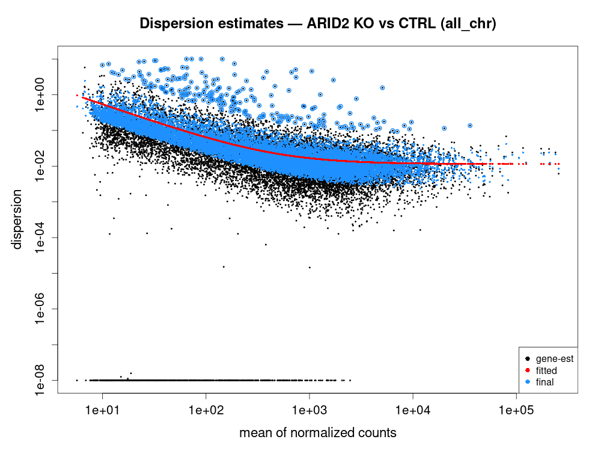
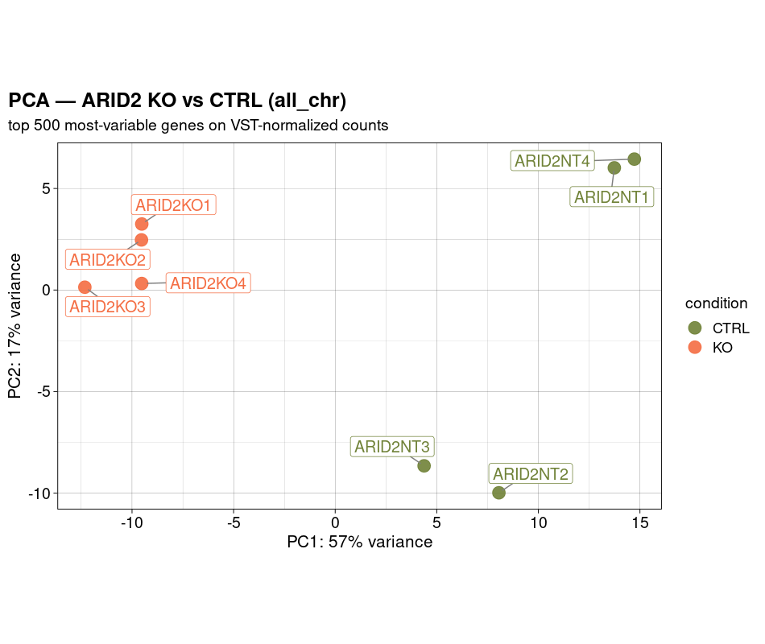
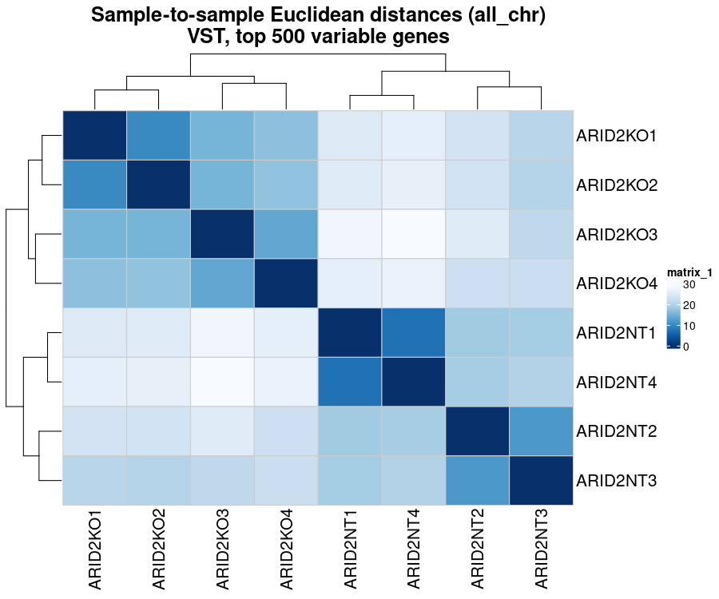
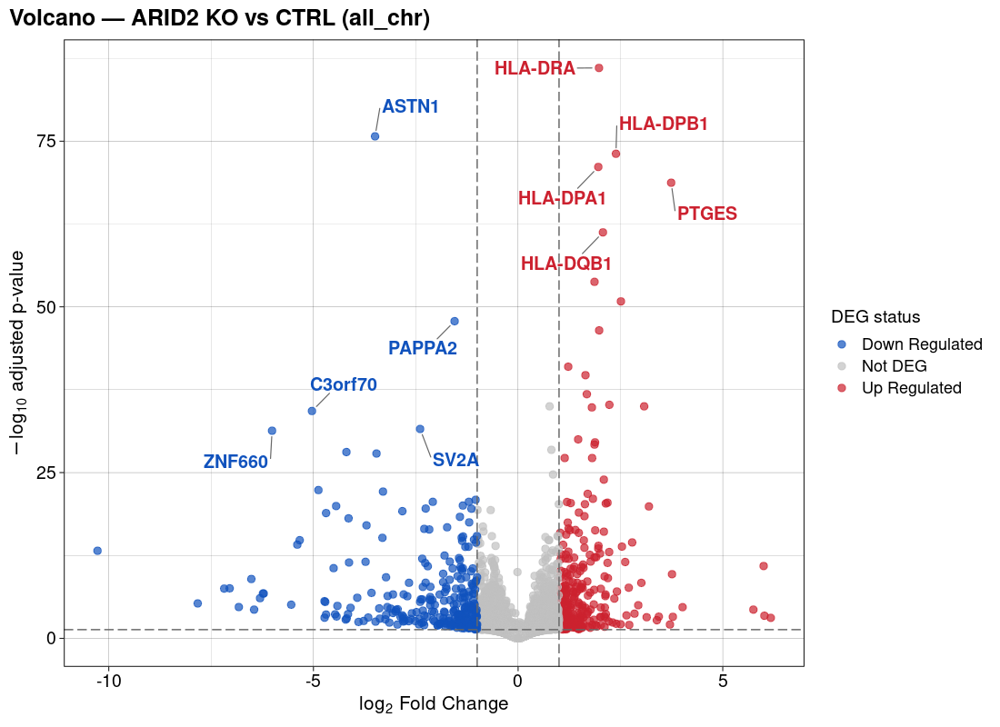
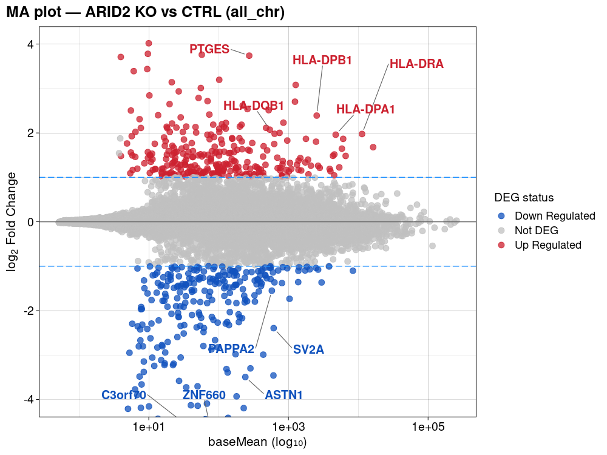
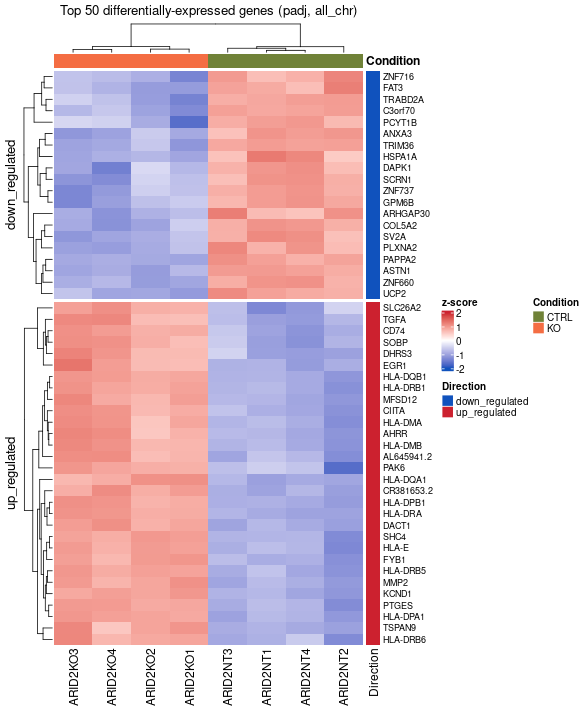
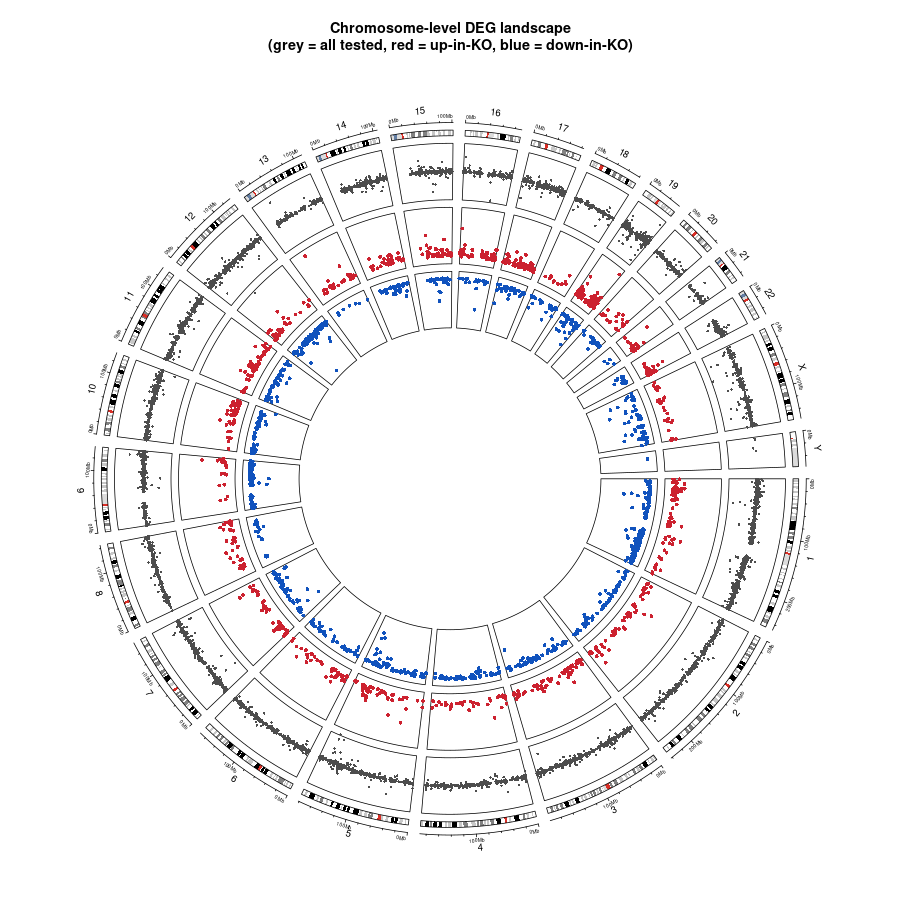
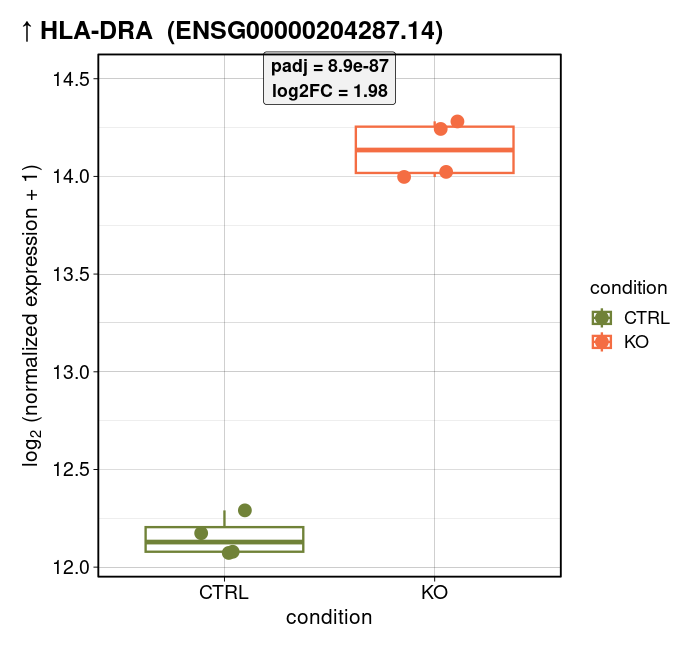
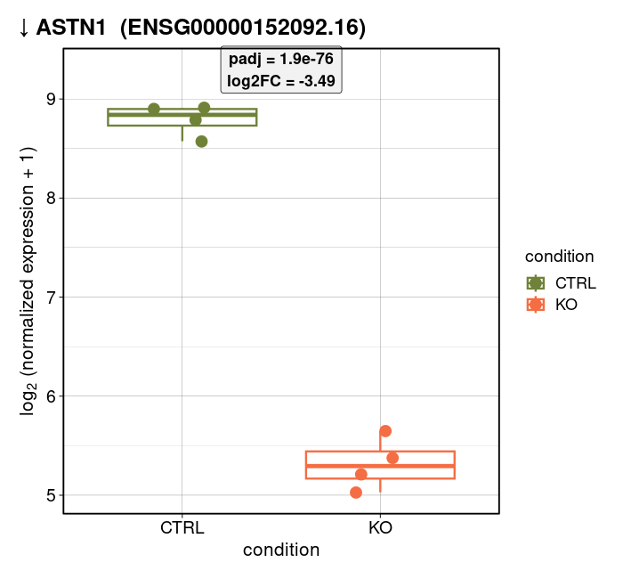
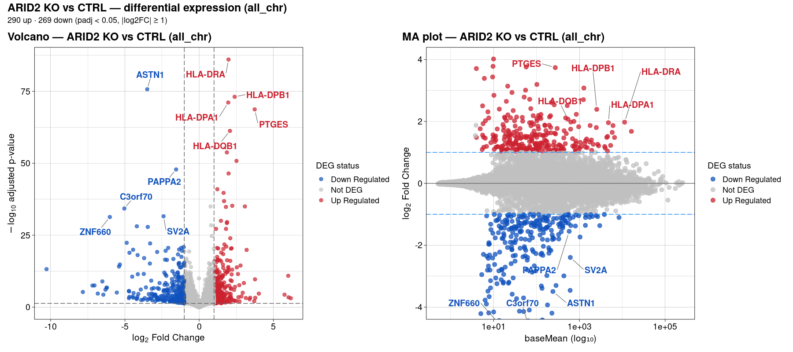

# Session 5 — Quantification + Differential Expression

Session 5 is a two-part R walk-through. **Part A (Sections 3-7)** takes the four chromosome-5 `quant.sf` files that Session 4 produced with Salmon, imports them with `tximport`, builds a DESeq2 object, and writes count matrices under `data_rna/reduced_chr5/processed/gene_expression/tables/`. **Part B (Sections 8-20)** switches to the full-genome pipeline results (already computed upstream, 22,717 tested genes × 8 samples) and runs the interpretation half of the session on `data_rna/all_chr/processed/`: dispersion, PCA, sample distances, volcano, MA, ComplexHeatmap, circos, per-gene boxplots, patchwork figure, gene-list export. End-to-end wall-clock: ~50 s.

## Setup

    cd /sc/arion/projects/BiNGS_bulk/${USER}/hands_on   # your own writable clone
    module load singularity/3.6.4
    singularity exec engine/singularity_containers/rbings_20250925.sif R

Then inside R:

    source("code_rna/session_05_deg_analysis.R")

Or step through with Ctrl+Enter one section at a time — every section is safe to re-run.

---

## Section 0 — Session overview

Rationale for the two-part split: quantification is the pedagogical point; chr5 keeps it fast (~50 s tximport + DESeq2). But chr5 alone (~2,600 genes, n=2 per group) has too few significant DEGs after FDR to interpret meaningfully, so all downstream visualization runs on the full-genome results (n=4 per group, 559 DEGs).

---

## Section 1 — Environment

Locate the salmon output tree (`data_rna/reduced_chr5/preprocessed/salmon/`), the shared reference annotation (`engine/annotation/`), and both output roots (`reduced_chr5/processed/` for Part A, `all_chr/processed/` for Part B). Any missing inputs fall back to the shared reference tree so a participant's script keeps running even if they haven't rebuilt everything locally.

```r
pdf(NULL)                                                    # silence stray Rplots.pdf
data_dir         <- file.path(getwd(), "data_rna")
salmon_input_dir <- file.path(data_dir, "reduced_chr5", "preprocessed", "salmon")
ref_dir          <- if (dir.exists(file.path(getwd(), "engine", "annotation"))) getwd()
                    else "/sc/arion/projects/BiNGS/bings_omics/data/bings/2026/bulk_course_data/hands_on"

ge_dir           <- file.path(data_dir, "reduced_chr5", "processed", "gene_expression")
deg_dir          <- file.path(data_dir, "reduced_chr5", "processed", "differential_expression")
allchr_root      <- file.path(data_dir, "all_chr", "processed")

for (d in c(file.path(ge_dir,  c("tables","figures")),
            file.path(deg_dir, c("tables","figures")),
            file.path(allchr_root, "gene_expression",         "figures"),
            file.path(allchr_root, "differential_expression", "figures"))) {
  dir.create(d, showWarnings = FALSE, recursive = TRUE)
}
```

```text
Running as user: ulukag01
Reading Salmon quants from: .../data_rna/reduced_chr5/preprocessed/salmon
Chr5 gene-expression outputs → .../reduced_chr5/processed/gene_expression (tables/)
All_chr downstream → .../all_chr/processed/{gene_expression,differential_expression}/
```

---

## Section 2 — Libraries

One-shot load of every package the session needs. `GenomicFeatures` + `AnnotationDbi` for the TxDb; `tximport` for Salmon; `DESeq2` + `apeglm` for the model and shrinkage; `ggplot2` / `ggrepel` / `pheatmap` / `RColorBrewer` for exploratory plots; `ComplexHeatmap` / `circlize` for the DEG heatmap + circos; `patchwork` for the combined figure; `org.Hs.eg.db` + `TxDb.Hsapiens.UCSC.hg38.knownGene` for circos coordinates.

```r
library(GenomicFeatures); library(AnnotationDbi); library(tximport)
library(DESeq2); library(apeglm)
library(ggplot2); library(ggrepel); library(pheatmap); library(RColorBrewer)
library(ComplexHeatmap); library(circlize); library(patchwork)
suppressPackageStartupMessages({
  library(org.Hs.eg.db)
  library(TxDb.Hsapiens.UCSC.hg38.knownGene)
})

bump_theme <- function(base_size = 14) {
  theme_linedraw(base_size = base_size) +
    theme(plot.title    = element_text(size = base_size + 4, face = "bold"),
          axis.title    = element_text(size = base_size + 1),
          axis.text     = element_text(size = base_size))
}
```

Expect the usual Bioconductor startup banners. `ComplexHeatmap::pheatmap` masks `pheatmap::pheatmap`, which is fine — Section 11 still calls the `pheatmap` function name and both signatures accept the same args.

---

## Section 2.5 — `save_figure_panel` helper

Every plot in the session writes to disk as **both** PNG (raster) and PDF (vector) at identical physical dimensions, under `<figures_dir>/{png,pdf}/<name>.<ext>`. `save_figure_both()` wraps `save_figure_panel()` for ggplot / pheatmap outputs; `save_base_plot_both()` re-draws base-R plots (`plotDispEsts`, `plotMA`, `ComplexHeatmap::draw`, circos) into fresh devices so `recordPlot()` isn't needed. Each save emits a `↳ saved …` `message()` so you can see files landing.

---

## Section 3 — The experiment

Four SKmel147 (melanoma) RNA-seq libraries: two ARID2 WT (control) reps and two ARID2 KO (CRISPR knockout of the PBAF/SWI-SNF subunit ARID2) reps. Only chr5-mapped reads are kept in Part A. Metadata is read from the shared reference CSV and re-labeled with display-friendly column names.

```r
sample_metadata_df <- read.csv(sample_metadata_path, stringsAsFactors = FALSE)
colnames(sample_metadata_df) <- c("Sample Names", "File Names", "Replicate",
                                  "Genotype", "Cell Line", "Species")
rownames(sample_metadata_df) <- sample_metadata_df[["Sample Names"]]
print(sample_metadata_df)
```

```text
               Sample Names                            File Names Replicate
ARID2_WT_Rep1 ARID2_WT_Rep1 SKMel147_ARID2WT_R1_RNA_chr5_R1.fastq      rep1
ARID2_WT_Rep2 ARID2_WT_Rep2 SKMel147_ARID2WT_R2_RNA_chr5_R1.fastq      rep2
ARID2_KO_Rep1 ARID2_KO_Rep1 SKMel147_ARID2KO_R1_RNA_chr5_R1.fastq      rep1
ARID2_KO_Rep2 ARID2_KO_Rep2 SKMel147_ARID2KO_R2_RNA_chr5_R1.fastq      rep2
              Genotype           Cell Line      Species
ARID2_WT_Rep1 ARID2_WT SKmel147 (Melanoma) homo_sapiens
ARID2_WT_Rep2 ARID2_WT SKmel147 (Melanoma) homo_sapiens
ARID2_KO_Rep1 ARID2_KO SKmel147 (Melanoma) homo_sapiens
ARID2_KO_Rep2 ARID2_KO SKmel147 (Melanoma) homo_sapiens
```

---

## Section 4 — Annotation data

Load the pre-built chr5 TxDb SQLite (built once from GENCODE v36) and pull a compact gene-level metadata table from the GTF (gene symbol, biotype, HGNC ID). We attach this to the DESeqDataSet later so DEG output rows carry biology-friendly labels.

```r
gtf_path  <- file.path(annotation_dir, "data", "gencode.v36.annotation_chr5.gtf")
txdb_path <- file.path(annotation_dir, "data", "gencode.v36.annotation_chr5.sqlite")

txdb          <- AnnotationDbi::loadDb(txdb_path)
gtf           <- rtracklayer::import(gtf_path)
gtf_df        <- as.data.frame(gtf)
gene_metadata <- gtf_df[gtf_df$type == "gene",
                        c("gene_id", "gene_type", "gene_name", "havana_gene", "hgnc_id")]
rownames(gene_metadata) <- gene_metadata$gene_id

table(gene_metadata$gene_type)
```

```text
                            lncRNA                              miRNA
                               955                                 74
                          misc_RNA               processed_pseudogene
                               119                                607
                    protein_coding                               rRNA
                               885                                  1
                   rRNA_pseudogene                             snoRNA
                                24                                 40
                             snRNA                                TEC
                               103                                 72
  transcribed_processed_pseudogene     transcribed_unitary_pseudogene
                                15                                  4
transcribed_unprocessed_pseudogene    translated_processed_pseudogene
                                26                                  1
                unitary_pseudogene             unprocessed_pseudogene
                                 5                                 56
                         vault_RNA
                                 1
```

---

## Section 5 — Import Salmon quantifications

Salmon writes per-**transcript** abundance. DESeq2 needs per-**gene** counts, so we build a `tx2gene` map from the TxDb and let `tximport::summarizeToGene()` do the aggregation.

```r
sample_metadata_df$file_path <- file.path(
  salmon_input_dir,
  gsub("_RNA_chr5_R1.fastq$", "", sample_metadata_df[["File Names"]]),
  "quant.sf"
)
stopifnot(all(file.exists(sample_metadata_df$file_path)))
write.csv(sample_metadata_df, file.path(ge_tables, "sample_metadata.csv"),
          row.names = FALSE)

k        <- keys(txdb, keytype = "TXNAME")
tx2gene  <- AnnotationDbi::select(txdb, k, "GENEID", "TXNAME")
txi_tx   <- tximport(files, type = "salmon", txOut = TRUE)
txi_gene <- summarizeToGene(txi_tx, tx2gene)

raw_gene_counts <- as.matrix(round(txi_gene$counts))
mode(raw_gene_counts) <- "integer"
write.csv(raw_gene_counts, file.path(ge_tables, "raw_gene_expression.csv"),
          row.names = TRUE)
```

```text
'select()' returned 1:1 mapping between keys and columns
reading in files with read_tsv
1 2 3 4
summarizing abundance
summarizing counts
summarizing length
✓ Count matrix: 2985 genes × 4 samples
```

`head -6 data_rna/reduced_chr5/processed/gene_expression/tables/raw_gene_expression.csv`:

```text
"","ARID2_WT_Rep1","ARID2_WT_Rep2","ARID2_KO_Rep1","ARID2_KO_Rep2"
"ENSG00000006837.12",25,22,13,13
"ENSG00000011083.9",0,0,3,0
"ENSG00000013561.18",1555,1200,1234,1631
"ENSG00000015479.20",16775,10968,8897,14413
"ENSG00000016082.15",98,78,45,80
```

---

## Section 6 — Build the DESeq2 object

`DESeqDataSetFromTximport()` bundles counts, sample metadata, and a design formula (`~ Genotype`). Pre-filter to genes with ≥10 reads in ≥2 samples, relevel so WT is the reference (positive `log2FoldChange` ⇒ higher in KO), then fit — one `DESeq()` call runs size-factor estimation, dispersion estimation, and Wald tests.

```r
dds <- DESeqDataSetFromTximport(txi_gene,
                                colData = sample_metadata_df,
                                design  = ~ Genotype)
mcols(dds) <- gene_metadata[rownames(dds), ]

smallestGroupSize <- 2
keep <- rowSums(counts(dds) >= 10) >= smallestGroupSize
dds  <- dds[keep, ]

dds$Genotype <- relevel(dds$Genotype, ref = "ARID2_WT")
dds <- DESeq(dds)
```

```text
using counts and average transcript lengths from tximport
After pre-filter: 764 genes retained
estimating size factors
using 'avgTxLength' from assays(dds), correcting for library size
estimating dispersions
gene-wise dispersion estimates
mean-dispersion relationship
final dispersion estimates
fitting model and testing
```

The `~ Genotype` formula fits `log(mean_expression) = intercept + β_Genotype × I(sample is KO)`; β_Genotype is the tested effect. Add `+ Batch` here if you had a batch to model out.

---

## Section 7 — Exploratory analysis: normalization

Two normalizations, two use cases: **median-of-ratios** (count scale, good for looking at single genes) and **VST** (log-like, variance-stabilized, good for PCA / clustering / heatmaps). Both matrices are written to `reduced_chr5/processed/gene_expression/tables/`.

```r
norm_medratios <- counts(dds, normalized = TRUE)
write.csv(as.data.frame(norm_medratios),
          file.path(ge_tables, "normalized_gene_expression_medianratios.csv"),
          row.names = TRUE)

norm_vst <- vst(dds, blind = TRUE, nsub = 500)   # nsub only needed on tiny datasets
write.csv(as.data.frame(assay(norm_vst)),
          file.path(ge_tables, "normalized_gene_expression_vst.csv"),
          row.names = TRUE)

head(norm_medratios, 5)
head(assay(norm_vst),  5)
```

```text
                   ARID2_WT_Rep1 ARID2_WT_Rep2 ARID2_KO_Rep1 ARID2_KO_Rep2
ENSG00000006837.12      17.91029      20.91804      16.72828      14.83115
ENSG00000013561.18    1227.10100    1225.23030    1561.22915    1599.98559
ENSG00000015479.20   14561.38274   13340.34759   10061.82959   12831.84244
ENSG00000016082.15      87.40675      75.78392      58.19353      71.38820
ENSG00000019582.15    7321.56328    7778.44975   20546.14145   21218.98721

                   ARID2_WT_Rep1 ARID2_WT_Rep2 ARID2_KO_Rep1 ARID2_KO_Rep2
ENSG00000006837.12      7.965924      8.001868      7.950957      7.925756
ENSG00000013561.18     10.618372     10.616630     10.899271     10.928515
ENSG00000015479.20     13.865477     13.742321     13.347736     13.687760
ENSG00000016082.15      8.494478      8.429370      8.319453      8.403327
ENSG00000019582.15     12.907531     12.990909     14.351957     14.397651
```

---

## ═══ Part B — full-genome DEG (upstream pipeline results) ═══

The reduced chr5 dataset (2 reps × 2 conditions, ~2,600 genes) has too little dispersion signal to survive FDR. From here on the session reads pre-computed counts + DEG results for the full-genome 8-sample dataset (4 KO + 4 CTRL, 22,717 tested genes) from `data_rna/all_chr/processed/`.

---

## Section 8 — Load all_chr data

Read the upstream DEG CSV + raw + median-normalized counts, factorize the `deg_status` column, align sample columns to the metadata order, build a fresh `dds_all` (needed for `plotDispEsts` in Section 9), and write the VST matrix — this is the one all_chr GE table that Session 5 itself produces (the raw + medratios matrices were staged in from the fridls01 pipeline).

```r
deg_all <- read.csv(file.path(allchr_de_tables,
                              "deseq_comparison_KO_vs_CTRL_all_genes.csv"),
                    stringsAsFactors = FALSE)
deg_all$deg_status <- factor(
  ifelse(deg_all$status == "up_regulated",   "Up Regulated",
  ifelse(deg_all$status == "down_regulated", "Down Regulated", "Not DEG")),
  levels = c("Down Regulated", "Not DEG", "Up Regulated"))
print(table(DEG_Status = deg_all$deg_status))

meta_all$condition <- factor(meta_all$condition, levels = c("CTRL", "KO"))
allchr_cond_cols   <- c("CTRL" = "#708238", "KO" = "#F46D43")

dds_all <- DESeqDataSetFromMatrix(count_mat_all, colData = meta_all,
                                  design = ~ condition)
keep_all <- rowSums(counts(dds_all) >= 10) >= min(table(meta_all$condition))
dds_all  <- dds_all[keep_all, ]
dds_all  <- DESeq(dds_all)

norm_vst_all <- vst(dds_all, blind = TRUE, nsub = min(1000, nrow(dds_all)))
vst_mat_all  <- cbind(gene_id = rownames(assay(norm_vst_all)),
                      as.data.frame(assay(norm_vst_all)))
write.csv(vst_mat_all,
          file.path(allchr_ge_tables, "normalized_gene_expression_vst.csv"),
          row.names = FALSE)
```

```text
all_chr DEG counts (KO vs CTRL):
DEG_Status
Down Regulated        Not DEG   Up Regulated
           269          22157            290
Genes after prefilter (≥10 counts in ≥4 samples): 14986
estimating size factors
estimating dispersions
gene-wise dispersion estimates
mean-dispersion relationship
final dispersion estimates
fitting model and testing
Wrote all_chr VST table to .../all_chr/processed/gene_expression/tables/normalized_gene_expression_vst.csv (14986 genes)
```

`head -6 data_rna/all_chr/processed/gene_expression/tables/normalized_gene_expression_vst.csv`:

```text
"gene_id","ARID2KO1","ARID2KO2","ARID2KO3","ARID2KO4","ARID2NT1","ARID2NT2","ARID2NT3","ARID2NT4"
"ENSG00000000003.15",9.8186,9.8232,9.5122,9.8034,9.8056,10.0856,9.8168,9.8522
"ENSG00000000419.13",11.4458,11.6594,11.0391,11.2126,11.3526,11.6007,11.4579,11.3968
"ENSG00000000457.14",8.4167,8.4206,8.4880,8.5969,8.4312,8.7158,8.7096,8.4758
"ENSG00000000460.17",9.2812,9.0883,9.1679,9.1844,9.2309,10.0173,9.7761,9.2770
"ENSG00000000971.16",6.9331,6.9625,6.9998,7.1524,7.1290,7.0211,7.1744,7.0504
```

The DEG source table (`deseq_comparison_KO_vs_CTRL_all_genes.csv`) contains the results computed by fridls01's DESeq2 run — first rows for reference:

```text
baseMean,log2FoldChange,lfcSE,pvalue,padj,gene_id,gene_name,status
11328.56,1.9758,0.0983,5.26e-91,8.92e-87,ENSG00000204287.14,HLA-DRA, up_regulated
2540.22,2.3904,0.1293,1.42e-77,8.00e-74,ENSG00000223865.11,HLA-DPB1,up_regulated
4753.12,1.9598,0.1075,1.82e-75,7.71e-72,ENSG00000231389.7, HLA-DPA1,up_regulated
274.51, 3.7400,0.2083,5.50e-73,1.86e-69,ENSG00000148344.11,PTGES,   up_regulated
541.34, 2.0733,0.1225,2.02e-65,5.72e-62,ENSG00000179344.16,HLA-DQB1,up_regulated
```

---

## Section 9 — Dispersion plot (all_chr)

Diagnostic: each dot is one gene, red curve is the mean-dispersion trend DESeq2 fits, blue dots are the final shrunk estimates used in testing. With 14,986 prefiltered genes and n=4 per group the fit is visibly cleaner than the chr5 fit from Part A.

```r
save_base_plot_both(
  quote({
    par(cex.axis = 1.3, cex.lab = 1.4, cex.main = 1.5, mar = c(5, 5, 4, 2))
    plotDispEsts(dds_all,
                 main = "Dispersion estimates — ARID2 KO vs CTRL (all_chr)")
  }),
  output_directory = allchr_ge_figures, figure_name = "dispersion_estimates",
  width = 1000, height = 750, pointsize = 16)
```



---

## Section 10 — PCA (all_chr)

PCA on VST-transformed counts, top-500 most variable genes. With 4 reps per group we expect PC1 to separate KO from CTRL and replicates to cluster tightly by condition.

```r
pcaData    <- plotPCA(norm_vst_all, intgroup = "condition", ntop = 500,
                      returnData = TRUE)
percentVar <- round(100 * attr(pcaData, "percentVar"))

p_pca <- ggplot(pcaData, aes(PC1, PC2, color = condition)) +
  geom_point(size = 5, alpha = 0.9) +
  scale_color_manual(values = allchr_cond_cols) +
  xlab(paste0("PC1: ", percentVar[1], "% variance")) +
  ylab(paste0("PC2: ", percentVar[2], "% variance")) +
  geom_label_repel(aes(label = name), size = 5, box.padding = 0.5,
                   segment.color = "grey50", show.legend = FALSE) +
  coord_fixed() +
  labs(title = "PCA — ARID2 KO vs CTRL (all_chr)",
       subtitle = "top 500 most-variable genes on VST-normalized counts") +
  bump_theme()
save_figure_both(p_pca, output_directory = allchr_ge_figures,
                 figure_name = "pca_arid2ko_vs_ctrl",
                 width = 950, height = 800)
```



---

## Section 11 — Sample-to-sample distances (all_chr)

Euclidean distance on VST counts (top-500 variable genes), plotted as a `pheatmap` with hierarchical clustering. Same-condition pairs should be darker (closer) than cross-condition pairs — a coarser but complementary view to PCA.

```r
rv     <- rowVars(assay(norm_vst_all))
select <- order(rv, decreasing = TRUE)[seq_len(min(500, length(rv)))]

sampleDists      <- dist(t(assay(norm_vst_all[select, ])))
sampleDistMatrix <- as.matrix(sampleDists)

p_sample_dist <- pheatmap(sampleDistMatrix,
         clustering_distance_rows = sampleDists,
         clustering_distance_cols = sampleDists,
         col = colorRampPalette(rev(brewer.pal(9, "Blues")))(255),
         border_color = "grey80",
         fontsize = 14, fontsize_row = 15, fontsize_col = 15,
         main = "Sample-to-sample Euclidean distances (all_chr)\nVST, top 500 variable genes")
save_figure_both(p_sample_dist, output_directory = allchr_ge_figures,
                 figure_name = "sample_to_sample_distances",
                 width = 900, height = 750)
```



---

## Section 12 — Shared "top labeled" DEG list

Pick the same 10 genes (top 5 up + top 5 down by adjusted p-value) to label in every downstream figure — volcano, MA, heatmap direction annotation, and per-gene boxplots. Consistent labeling ties the panels together.

```r
deg_cols <- c("Down Regulated" = "#1052bd",
              "Not DEG"        = "#c0c0c0",
              "Up Regulated"   = "#cc212f")

.up <- deg_all[deg_all$deg_status == "Up Regulated",   , drop = FALSE]
.dn <- deg_all[deg_all$deg_status == "Down Regulated", , drop = FALSE]
top_up_labeled   <- head(.up[order(.up$padj), ], n = 5)
top_down_labeled <- head(.dn[order(.dn$padj), ], n = 5)
top_labeled      <- rbind(top_down_labeled, top_up_labeled)
```

```text
Genes labeled in volcano / MA / boxplots (all_chr):
  ASTN1, PAPPA2, C3orf70, SV2A, ZNF660,
  HLA-DRA, HLA-DPB1, HLA-DPA1, PTGES, HLA-DQB1
```

The HLA-cluster (HLA-DRA / -DPB1 / -DPA1 / -DQB1) dominating the top-up hits is the ARID2 KO signature — PBAF loss de-represses MHC-II. The top-down hits are more scattered (neuronal + ECM).

---

## Section 13 — Volcano plot (all_chr)

`log2FoldChange` vs `-log10(padj)`, colored by `deg_status`. Dashed guides at `|LFC| = 1` and `padj = 0.05` mark the DEG cutoffs. `geom_text_repel` labels the top-10 genes with a fixed seed so the layout is reproducible across re-runs.

```r
pvalue_threshold <- 0.05
log2fc_threshold <- 1
volcano_df <- deg_all
volcano_df$neg_log10_pval <- -log10(volcano_df$padj)

p_volcano <- ggplot(volcano_df, aes(x = log2FoldChange, y = neg_log10_pval,
                                    color = deg_status)) +
  geom_point(alpha = 0.7, size = 2.5) +
  scale_color_manual(values = deg_cols) +
  geom_vline(xintercept = c(-log2fc_threshold, log2fc_threshold),
             linetype = "longdash", color = "grey40") +
  geom_hline(yintercept = -log10(pvalue_threshold),
             linetype = "longdash", color = "grey40") +
  geom_text_repel(data = transform(top_labeled, neg_log10_pval = -log10(padj)),
                  aes(label = gene_name), size = 5, fontface = "bold",
                  min.segment.length = 0, segment.color = "grey40",
                  box.padding = 1.2, point.padding = 0.6,
                  force = 8, force_pull = 0.5,
                  max.overlaps = Inf, seed = 42, show.legend = FALSE) +
  labs(colour = "DEG status",
       title = "Volcano — ARID2 KO vs CTRL (all_chr)") +
  bump_theme()
save_figure_both(p_volcano, output_directory = allchr_de_figures,
                 figure_name = "volcano_arid2ko_vs_ctrl",
                 width = 1100, height = 800)
```



---

## Section 14 — MA plot (all_chr)

`baseMean` (log10) vs `log2FoldChange`, y-axis clipped to `±4` so labels don't fly off. Repel parameters are tuned harder than the volcano because the MA panel is thin vertically. `nudge_y` pushes up-regulated labels above the cloud and down-regulated labels below it.

```r
p_ma <- ggplot(deg_all, aes(x = baseMean, y = log2FoldChange, color = deg_status)) +
  geom_point(alpha = 0.75, size = 3) +
  scale_color_manual(values = deg_cols) +
  scale_x_log10() +
  geom_hline(yintercept = 0, color = "grey40") +
  geom_hline(yintercept = c(-log2fc_threshold, log2fc_threshold),
             linetype = "longdash", color = "dodgerblue") +
  geom_text_repel(data = top_labeled, aes(label = gene_name),
                  size = 5, fontface = "bold",
                  min.segment.length = 0,
                  box.padding = 1.5, point.padding = 0.7,
                  force = 15, force_pull = 0.3,
                  nudge_y = ifelse(top_labeled$deg_status == "Up Regulated",
                                    0.9, -0.9),
                  direction = "both", max.overlaps = Inf,
                  max.iter = 20000, seed = 42, show.legend = FALSE) +
  labs(x = "baseMean (log₁₀)", y = expression(log[2]~"Fold Change"),
       colour = "DEG status",
       title = "MA plot — ARID2 KO vs CTRL (all_chr)") +
  coord_cartesian(ylim = c(-4, 4)) +
  bump_theme()
save_figure_both(p_ma, output_directory = allchr_de_figures,
                 figure_name = "ma_arid2ko_vs_ctrl",
                 width = 1000, height = 750)
```



---

## Section 15 — DEG heatmap (ComplexHeatmap, split by direction)

Row-scaled `log2(counts + 1)` for the top-50 DEGs by `padj`. `ComplexHeatmap::Heatmap` splits rows by direction (up vs down) so the up-block and down-block are visually separated; column annotation shows CTRL / KO condition. 559 total DEGs is too many for a slide — capping at 50 keeps rows legible.

```r
sig     <- deg_all[deg_all$deg_status != "Not DEG", , drop = FALSE]
sig     <- sig[order(sig$padj), ]
sig_top <- sig[seq_len(min(50, nrow(sig))), ]

row_mat_ch <- t(scale(t(log2(norm_mat_all[sig_top$gene_id, sample_cols_all,
                                          drop = FALSE] + 1))))
rownames(row_mat_ch) <- sig_top$gene_name

col_ann_ch <- ComplexHeatmap::HeatmapAnnotation(
  Condition = meta_all$condition,
  col = list(Condition = allchr_cond_cols))
row_ann_ch <- ComplexHeatmap::rowAnnotation(
  Direction = sig_top$status,
  col = list(Direction = c(up_regulated = "#cc212f", down_regulated = "#1052bd")))

ht_top50 <- ComplexHeatmap::Heatmap(
  row_mat_ch, name = "z-score",
  top_annotation = col_ann_ch, right_annotation = row_ann_ch,
  row_split = sig_top$status, cluster_columns = TRUE,
  cluster_row_slices = FALSE,
  col = circlize::colorRamp2(c(-2, 0, 2), c("#1052bd", "white", "#cc212f")),
  row_names_gp    = grid::gpar(fontsize = 9),
  column_names_gp = grid::gpar(fontsize = 12),
  column_title    = "Top 50 differentially-expressed genes (padj, all_chr)")

save_base_plot_both(
  quote(ComplexHeatmap::draw(ht_top50)),
  output_directory = allchr_de_figures,
  figure_name = "complexheatmap_top50_degs",
  width = 585, height = 715)
```



---

## Section 16 — Circos: genome-wide DEG log2FC (circlize)

Whole-genome view of the DE landscape on a `hg38` ideogram. Three tracks stacked outside-in: **(1)** every tested gene as a grey dot at its `log2FC`, **(2)** significant up-regulated genes (red, `padj < 0.05`), **(3)** significant down-regulated (blue). Requires ENSG → ENTREZ → GRanges mapping via `org.Hs.eg.db` + `TxDb.Hsapiens.UCSC.hg38.knownGene`; version suffixes on ENSG IDs are stripped for the lookup.

```r
eids <- sub("\\..*$", "", deg_all$gene_id)
suppressMessages({
  ens2entrez <- AnnotationDbi::mapIds(org.Hs.eg.db::org.Hs.eg.db,
                                      keys = eids, keytype = "ENSEMBL",
                                      column = "ENTREZID", multiVals = "first")
})

txdb    <- TxDb.Hsapiens.UCSC.hg38.knownGene::TxDb.Hsapiens.UCSC.hg38.knownGene
gene_gr <- GenomicFeatures::genes(txdb, single.strand.genes.only = TRUE)
mask    <- !is.na(ens2entrez) & ens2entrez %in% names(gene_gr)
gr      <- gene_gr[ens2entrez[mask]]

circos_all <- data.frame(chr   = as.character(GenomicRanges::seqnames(gr)),
                         start = GenomicRanges::start(gr),
                         end   = GenomicRanges::end(gr),
                         value = deg_all$log2FoldChange[mask],
                         sig   = !is.na(deg_all$padj[mask]) &
                                 deg_all$padj[mask] < 0.05)
autosomes  <- paste0("chr", c(1:22, "X", "Y"))
circos_all <- circos_all[circos_all$chr %in% autosomes, ]
circos_sig <- circos_all[circos_all$sig, ]

draw_circos <- quote({
  circos.clear(); par(mar = c(1, 1, 5, 1))
  circos.par("track.height" = 0.15, "gap.after" = 2)
  circos.initializeWithIdeogram(species = "hg38",
                                chromosome.index = autosomes)
  circos.genomicTrack(circos_all, ylim = c(-6, 6),
    panel.fun = function(region, value, ...)
      circos.genomicPoints(region, value, pch = 16, cex = 0.45, col = "grey30"))
  circos.genomicTrack(circos_sig[circos_sig$value > 0, ],
    ylim = c(0, max(circos_sig$value, na.rm = TRUE)),
    panel.fun = function(region, value, ...)
      circos.genomicPoints(region, value, pch = 16, cex = 0.7, col = "#cc212f"))
  circos.genomicTrack(circos_sig[circos_sig$value < 0, ],
    ylim = c(min(circos_sig$value, na.rm = TRUE), 0),
    panel.fun = function(region, value, ...)
      circos.genomicPoints(region, value, pch = 16, cex = 0.7, col = "#1052bd"))
  title("Chromosome-level DEG landscape\n(grey = all tested, red = up-in-KO, blue = down-in-KO)")
})
save_base_plot_both(draw_circos,
                    output_directory = allchr_de_figures,
                    figure_name = "circlize_deg_lfc_genome",
                    width = 900, height = 900)
```



The red cluster on chr6p21 is the HLA session-II locus lighting up in KO.

---

## Section 17 — Per-gene boxplots (10 total)

Loop over the top-10 labeled genes; for each, draw a boxplot + jitter of `log2(normalized_expression + 1)` per condition, overlay a label with `padj` and `log2FC` from the DE table, and title with an ↑ / ↓ arrow indicating direction. Ten files (5 up + 5 down) land under `differential_expression/figures/{png,pdf}/`.

```r
plot_gene_box <- function(g) {
  df <- data.frame(log2_norm_exp = log2(norm_mat_all[g$gene_id,
                                                     sample_cols_all] + 1),
                   condition     = meta_all$condition)
  y_top <- max(df$log2_norm_exp); y_rng <- diff(range(df$log2_norm_exp))
  arrow <- if (g$deg_status == "Up Regulated") "↑" else "↓"

  ggplot(df, aes(condition, log2_norm_exp, color = condition)) +
    geom_boxplot(outlier.shape = NA, linewidth = 0.8) +
    geom_jitter(width = 0.15, size = 4) +
    scale_color_manual(values = allchr_cond_cols) +
    annotate("label", x = 1.5, y = y_top + y_rng * 0.10,
             label = paste0("padj = ",   format(g$padj, digits = 2, scientific = TRUE),
                            "\nlog2FC = ", format(round(g$log2FoldChange, 2), nsmall = 2)),
             fill = "grey95", fontface = "bold", size = 4.5) +
    labs(y = expression(log[2] ~ "(normalized expression + 1)"),
         title = paste0(arrow, " ", g$gene_name, "  (", g$gene_id, ")")) +
    bump_theme()
}

for (i in seq_len(nrow(top_labeled))) {
  g   <- top_labeled[i, ]
  dir_ <- if (g$deg_status == "Up Regulated") "up" else "down"
  save_figure_both(plot_gene_box(g), output_directory = allchr_de_figures,
                   figure_name = paste0("boxplot_", dir_, "_",
                                        gsub("[^A-Za-z0-9_.-]+", "_", g$gene_name)),
                   width = 700, height = 650)
}
```

Sample up- and down-regulated panels:





The other 8 boxplots live in the same directory:
`boxplot_up_{HLA-DPB1,HLA-DPA1,PTGES,HLA-DQB1}.png` and `boxplot_down_{PAPPA2,C3orf70,SV2A,ZNF660}.png`.

---

## Section 18 — Combined Figure 1 (patchwork: volcano + MA)

Publication-style two-panel figure that stitches the volcano (Section 13) and MA (Section 14) side-by-side under a shared title and DEG-count subtitle.

```r
combined_figure <- (p_volcano | p_ma) +
  patchwork::plot_annotation(
    title    = "ARID2 KO vs CTRL — differential expression (all_chr)",
    subtitle = paste0(sum(deg_all$deg_status == "Up Regulated"),   " up · ",
                      sum(deg_all$deg_status == "Down Regulated"), " down ",
                      "(padj < 0.05, |log2FC| ≥ 1)"),
    theme    = theme(plot.title    = element_text(size = 18, face = "bold"),
                     plot.subtitle = element_text(size = 13)))
save_figure_both(combined_figure, output_directory = allchr_de_figures,
                 figure_name = "combined_figure_volcano_ma",
                 width = 1800, height = 800)
```



---

## Section 19 — Export gene lists (all_chr)

Plain-text one-symbol-per-line files. These are the standard input format for the functional-analysis tools in Session 6 (Enrichr / clusterProfiler / GSEA), so this hand-off is the bridge between sessions.

```r
upregulated_genes   <- deg_all$gene_name[deg_all$deg_status == "Up Regulated"]
downregulated_genes <- deg_all$gene_name[deg_all$deg_status == "Down Regulated"]

writeLines(upregulated_genes,   file.path(allchr_de_tables, "upregulated_degs.txt"))
writeLines(downregulated_genes, file.path(allchr_de_tables, "downregulated_degs.txt"))
```

```text
Up-regulated (290):
HLA-DRA
HLA-DPB1
HLA-DPA1
PTGES
HLA-DQB1
HLA-DRB1
HLA-DQA1
HLA-DRB5
MMP2
MFSD12
CD74
HLA-DMB
TGFA
CIITA
SHC4
...
... [260 more]

Down-regulated (269):
ASTN1
PAPPA2
C3orf70
SV2A
ZNF660
ARHGAP30
HSPA1A
ZNF716
SCRN1
ANXA3
UCP2
GPM6B
PLXNA2
PCYT1B
TRABD2A
...
... [239 more]
```

---

## Section 20 — Session info

<details><summary>Show full <code>sessionInfo()</code></summary>

```text
R version 4.3.1 (2023-06-16)
Platform: x86_64-pc-linux-gnu (64-bit)
Running under: Ubuntu 22.04.4 LTS

Matrix products: default
BLAS:   /usr/lib/x86_64-linux-gnu/openblas-pthread/libblas.so.3
LAPACK: /usr/lib/x86_64-linux-gnu/openblas-pthread/libopenblasp-r0.3.20.so;  LAPACK version 3.10.0

attached base packages:
[1] grid      stats4    stats     graphics  grDevices utils     datasets  methods   base

other attached packages:
 [1] TxDb.Hsapiens.UCSC.hg38.knownGene_3.18.0
 [2] org.Hs.eg.db_3.18.0
 [3] patchwork_1.1.3
 [4] circlize_0.4.15
 [5] ComplexHeatmap_2.18.0
 [6] RColorBrewer_1.1-3
 [7] pheatmap_1.0.12
 [8] ggrepel_0.9.4
 [9] ggplot2_3.4.4
[10] apeglm_1.24.0
[11] DESeq2_1.42.1
[12] SummarizedExperiment_1.32.0
[13] MatrixGenerics_1.14.0
[14] matrixStats_1.5.0-9000
[15] tximport_1.30.0
[16] GenomicFeatures_1.54.4
[17] AnnotationDbi_1.64.1
[18] Biobase_2.62.0
[19] GenomicRanges_1.54.1
[20] GenomeInfoDb_1.38.8
[21] IRanges_2.36.0
[22] S4Vectors_0.40.2
[23] BiocGenerics_0.48.1
```

</details>

---

## Where outputs live

    data_rna/reduced_chr5/processed/          — Part A (chr5 quantification tables)
    └── gene_expression/tables/
        ├── raw_gene_expression.csv
        ├── normalized_gene_expression_medianratios.csv
        ├── normalized_gene_expression_vst.csv
        └── sample_metadata.csv

    data_rna/all_chr/processed/               — Part B (full-genome DEG figures + tables)
    ├── gene_expression/
    │   ├── tables/normalized_gene_expression_vst.csv     (session 5 writes)
    │   └── figures/{png,pdf}/                            (dispersion, PCA, sample distances)
    └── differential_expression/
        ├── tables/{up,down}regulated_degs.txt            (session 5 writes)
        └── figures/{png,pdf}/                            (volcano, MA, complexheatmap, circos,
                                                            10 boxplots, patchwork combined)

Gene lists in `differential_expression/tables/` feed straight into Session 6 (functional enrichment).
