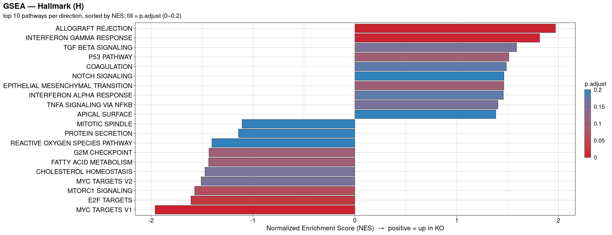
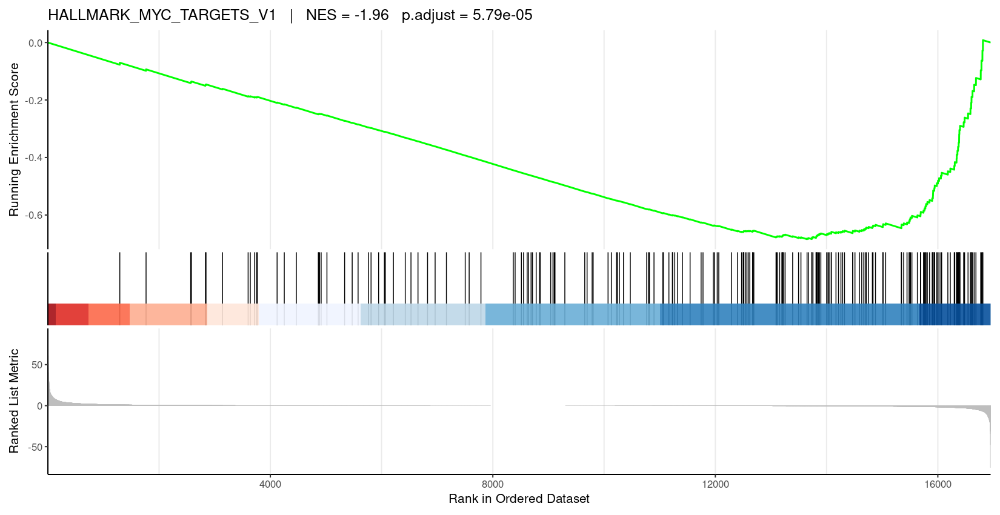
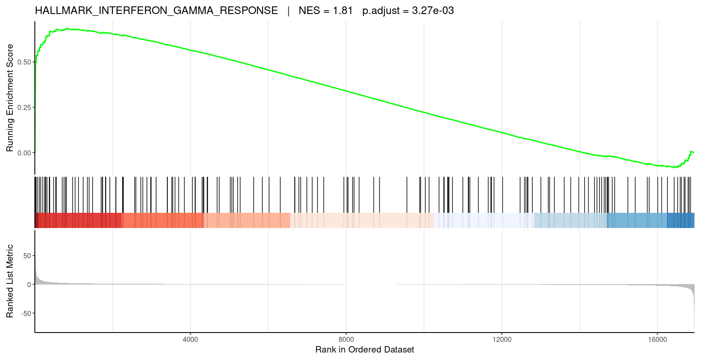
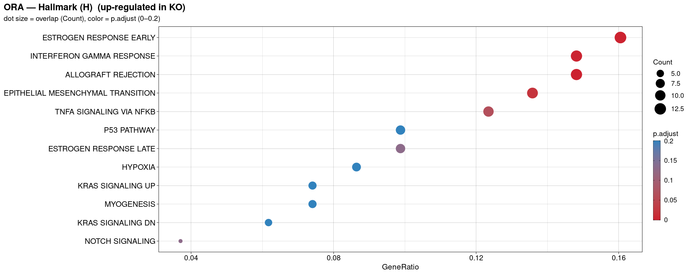
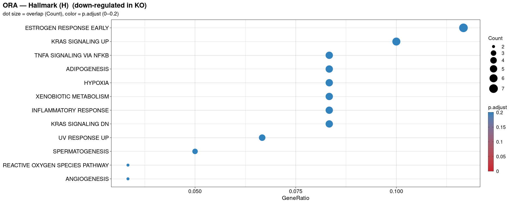
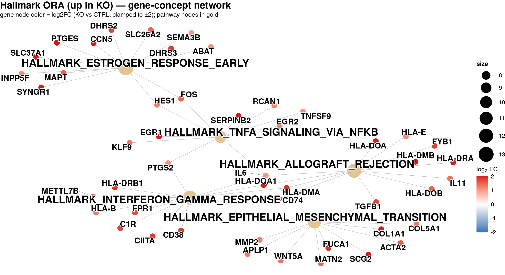
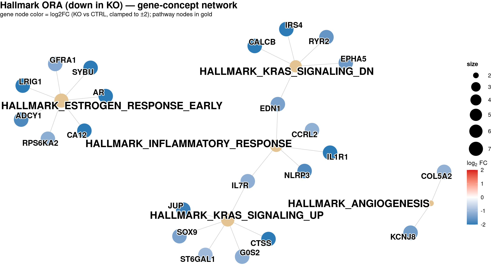
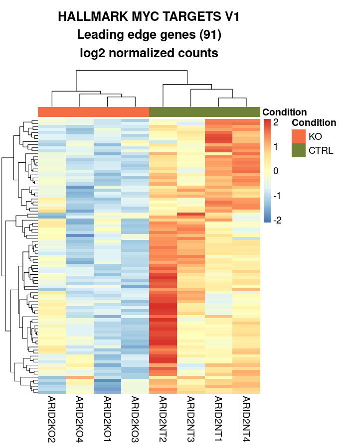
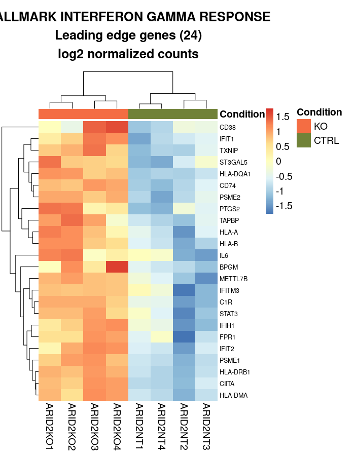

# Session 6 — Functional / Pathway Analysis

Session 6 asks *"so what?"* about the DEG table from Session 5: do those 559 up/down genes share a biological theme? Two complementary tests answer that — **ORA** (Over-Representation Analysis; hypergeometric test on the thresholded up/down lists) and **GSEA** (Gene Set Enrichment Analysis; Kolmogorov–Smirnov running-sum over the full ranked list). Both are run across seven MSigDB collections (Hallmark, KEGG, Reactome, WikiPathways, GO_BP/CC/MF) fetched on-the-fly via `msigdbr`, and every result is visualized with `enrichplot`. End-to-end wall-clock: **~70 s**.

## Setup

    cd /sc/arion/projects/BiNGS_bulk/${USER}/hands_on   # your own writable clone
    module load singularity/3.6.4
    singularity exec engine/singularity_containers/rbings_20250925.sif R

Then inside R:

    source("code_rna/session_06_functional_analysis.R")

Or step through with Ctrl+Enter one section at a time — every section is idempotent (safe to re-run).

---

## Section 0 — Session overview

Two methods, same DEG table, different questions:

- **ORA** — take the *thresholded* list of up- or down-regulated symbols, ask which pre-defined gene sets contain more of them than chance (hypergeometric / Fisher's exact). Sensitive to the FC + padj cutoffs you pick.
- **GSEA** — take *all* tested genes ranked by a signed statistic, ask whether any gene set's members cluster at the top or bottom of that rank (KS running sum). Cutoff-free, catches coordinated small effects.

Seven MSigDB collections cover the standard breadth: Hallmark (50 curated), KEGG / Reactome / WikiPathways (canonical pathways), and GO BP / CC / MF.

---

## Section 1 — Environment

`pdf(NULL)` up front routes the default plotting device to `/dev/null` (no stray `Rplots.pdf`). `ref_dir` falls back to the shared course tree if `engine/annotation/` isn't present in the CWD, so a participant clone that hasn't rebuilt everything still finds the fridls01 full-genome inputs.

```r
pdf(NULL)
data_dir  <- file.path(getwd(), "data_rna")
ref_dir   <- if (dir.exists(file.path(getwd(), "engine", "annotation"))) getwd()
             else "/sc/arion/projects/BiNGS/bings_omics/data/bings/2026/bulk_course_data/hands_on"
input_root <- file.path(ref_dir, "data_rna", "all_chr", "processed")

deg_path         <- file.path(input_root, "differential_expression", "tables",
                              "deseq_comparison_KO_vs_CTRL_all_genes.csv")
counts_norm_path <- file.path(input_root, "gene_expression", "tables",
                              "normalized_gene_expression_medianratios.csv")
sample_meta_path <- file.path(input_root, "gene_expression", "tables",
                              "sample_metadata.csv")

fa_dir     <- file.path(data_dir, "all_chr", "processed", "functional_analysis")
fa_tables  <- file.path(fa_dir, "tables")
fa_figures <- file.path(fa_dir, "figures")
```

```text
Running as user: ulukag01
Full-genome inputs read from: .../hands_on/data_rna/all_chr/processed
Functional-analysis output → .../hands_on/data_rna/all_chr/processed/functional_analysis (tables/, figures/)
```

---

## Section 2 — Libraries

One-shot load of everything the session needs: `clusterProfiler` for the GSEA + ORA wrappers, `msigdbr` for MSigDB gene sets, `enrichplot` for dotplot / gseaplot2 / cnetplot, `org.Hs.eg.db` for human gene-ID annotation, plus the tidy-plotting stack (`ggplot2` / `dplyr` / `stringr` / `pheatmap`).

```r
library(clusterProfiler)   # GSEA + ORA wrappers
library(msigdbr)           # MSigDB gene sets
library(enrichplot)        # dotplot / gseaplot2 / cnetplot
library(org.Hs.eg.db)      # human gene-ID annotation
library(DOSE)              # helpers used by enrichplot

library(ggplot2); library(ggrepel); library(dplyr); library(tidyr)
library(forcats); library(stringr); library(scales)
library(pheatmap); library(RColorBrewer)
```

<details>
<summary>Show terminal output (Bioconductor startup banners)</summary>

```text
clusterProfiler v4.10.1  For help: https://yulab-smu.top/biomedical-knowledge-mining-book/
If you use clusterProfiler in published research, please cite:
T Wu, E Hu, S Xu, ... clusterProfiler 4.0. The Innovation. 2021, 2(3):100141

Attaching package: 'clusterProfiler'
The following object is masked from 'package:stats':
    filter

Loading required package: AnnotationDbi
Loading required package: BiocGenerics
Loading required package: Biobase
Welcome to Bioconductor
...
DOSE v3.28.2  For help: https://yulab-smu.top/biomedical-knowledge-mining-book/
```

</details>

The `filter` mask from clusterProfiler is important: use `dplyr::filter` explicitly (as the script does) or load `dplyr` *after* `clusterProfiler`.

---

## Section 2.5 — `save_figure_panel` helper

Same helper as Session 5. Every plot writes as **both** PNG (raster) and PDF (vector) at identical physical dimensions under `<figures_dir>/{png,pdf}/<name>.<ext>`. `save_figure_both()` wraps `save_figure_panel()` and emits a `↳ saved …` `message()` per write so you can watch files land.

```r
save_figure_both <- function(figure_panel, output_directory, figure_name,
                             width, height, dpi = 100, ...) {
  save_figure_panel(figure_panel, output_directory, figure_name,
                    output_type = "png",
                    width = width, height = height, res = dpi, ...)
  save_figure_panel(figure_panel, output_directory, figure_name,
                    output_type = "pdf",
                    width = width / dpi, height = height / dpi, ...)
  message("  ↳ saved  ", file.path(output_directory, "png", paste0(figure_name, ".png")))
}
```

The crucial detail is `res = dpi` on the `png()` call: a 1950-px-wide PNG at 100 dpi is physically 19.5 in, matching the 19.5-in-wide PDF, so text point sizes render at the same visual scale in both formats.

---

## Section 3 — Load DEG + gene expression + sample metadata

This is the same biology as Session 5 (SKmel147 ARID2 KO vs CTRL) but on the *full genome* (22,716 tested genes / 60,240 total gene models) from fridls01's completed pipeline run. Session 5 chr5-only kept turnaround fast; here we need real numbers so the enrichment stats are meaningful.

```r
deg         <- read.csv(deg_path,        stringsAsFactors = FALSE)
counts_norm <- read.csv(counts_norm_path, stringsAsFactors = FALSE)
sample_meta <- read.csv(sample_meta_path, stringsAsFactors = FALSE)

cat("DEG rows:                ", nrow(deg), "\n")
cat("Gene-expression rows:    ", nrow(counts_norm), "\n")
cat("Samples:                 ", nrow(sample_meta), "\n\n")
print(table(deg$status))
```

```text
DEG rows:                 22716
Gene-expression rows:     60240
Samples:                  8

down_regulated        not_deg   up_regulated
           269          22157            290
```

Sample metadata — 4 KO + 4 CTRL:

```text
  sample_id replicate condition
1  ARID2KO1      rep1        KO
2  ARID2KO2      rep2        KO
3  ARID2KO3      rep3        KO
4  ARID2KO4      rep4        KO
5  ARID2NT1      rep1      CTRL
6  ARID2NT2      rep2      CTRL
7  ARID2NT3      rep3      CTRL
8  ARID2NT4      rep4      CTRL
```

Top-5 hits by padj — the classic ARID2-KO signature (HLA session II derepression up; ASTN1 / PAPPA2 down):

```text
Top 5 up-regulated by padj:
  gene_name log2FoldChange         padj
1   HLA-DRA       1.975769 8.915151e-87
2  HLA-DPB1       2.390433 8.004683e-74
3  HLA-DPA1       1.959768 7.705355e-72
4     PTGES       3.740033 1.864209e-69
5  HLA-DQB1       2.073300 5.722356e-62

Top 5 down-regulated by padj:
  gene_name log2FoldChange         padj
1     ASTN1      -3.494755 1.860495e-76
2    PAPPA2      -1.551274 1.448956e-48
3   C3orf70      -5.035867 5.192586e-35
4      SV2A      -2.394553 2.630003e-32
5    ZNF660      -6.010910 4.852144e-32
```

---

## Section 4 — Prepare enrichment inputs

Two shapes needed. **ORA** wants a *hit list* (up or down symbols) plus a *universe* (all tested symbols) for the hypergeometric background. **GSEA** wants a *ranked* named numeric vector, decreasing — we use the "combined score" `sign(log2FC) × -log10(padj)` (clamped at 300 to keep p=0 rows finite), which is what the BiNGS B3 pipeline uses.

```r
deg_dedup <- deg |>
  filter(!is.na(gene_name), gene_name != "", !is.na(padj), !is.na(log2FoldChange)) |>
  arrange(padj) |>
  distinct(gene_name, .keep_all = TRUE)

ranked <- deg_dedup |>
  mutate(combined_score = sign(log2FoldChange) *
                          pmin(-log10(pmax(padj, 1e-300)), 300)) |>
  arrange(desc(combined_score))
gene_list <- setNames(ranked$combined_score, ranked$gene_name)

universe_genes <- deg_dedup$gene_name
up_genes       <- deg_dedup$gene_name[deg_dedup$status == "up_regulated"]
down_genes     <- deg_dedup$gene_name[deg_dedup$status == "down_regulated"]
```

```text
Ranked list length: 16949
Head:
 HLA-DRA HLA-DPB1 HLA-DPA1    PTGES HLA-DQB1
86.04987 73.09666 71.11321 68.72951 61.24243
Tail:
   ZNF660      SV2A   C3orf70    PAPPA2     ASTN1
-31.31407 -31.58004 -34.28462 -47.83894 -75.73037

Universe: 16949 | up: 290 | down: 269
```

`ranked` has 16,949 unique symbols (some Ensembl IDs share a HGNC symbol or lack one entirely; the dedup keeps the smallest-padj row per symbol). GSEA operates on this; ORA operates on `up_genes` / `down_genes` against `universe_genes`.

---

## Section 5 — MSigDB collections via `msigdbr`

`msigdbr::msigdbr(species, category, subcategory)` returns a tidy per-gene-per-set data.frame. We reduce each to a **TERM2GENE** map (`gs_name`, `gene_symbol`) — the input format `clusterProfiler` wants.

```r
collections <- list(
  "Hallmark (H)"         = list(category = "H",  subcategory = NULL),
  "KEGG (C2 CP)"         = list(category = "C2", subcategory = "CP:KEGG"),
  "Reactome (C2 CP)"     = list(category = "C2", subcategory = "CP:REACTOME"),
  "WikiPathways (C2 CP)" = list(category = "C2", subcategory = "CP:WIKIPATHWAYS"),
  "GO — BP (C5)"         = list(category = "C5", subcategory = "GO:BP"),
  "GO — CC (C5)"         = list(category = "C5", subcategory = "GO:CC"),
  "GO — MF (C5)"         = list(category = "C5", subcategory = "GO:MF")
)

fetch_t2g <- function(x) {
  args <- c(list(species = "Homo sapiens", category = x$category),
            if (!is.null(x$subcategory)) list(subcategory = x$subcategory))
  m <- do.call(msigdbr::msigdbr, args)
  m |> dplyr::select(gs_name, gene_symbol) |> distinct()
}

t2g_all <- lapply(collections, fetch_t2g)
```

Size summary — Hallmark is compact (50 sets), GO_BP is by far the largest:

```text
                               Collection Pathways Total_gene_memberships
Hallmark (H)                 Hallmark (H)       50                   7321
KEGG (C2 CP)                 KEGG (C2 CP)      186                  12797
Reactome (C2 CP)         Reactome (C2 CP)     1615                  89476
WikiPathways (C2 CP) WikiPathways (C2 CP)      664                  30202
GO — BP (C5)                 GO — BP (C5)     7658                 633008
GO — CC (C5)                 GO — CC (C5)     1006                  99451
GO — MF (C5)                 GO — MF (C5)     1738                 108488
```

---

## Section 6 — GSEA across all 7 collections

`clusterProfiler::GSEA` wraps `fgsea`. `pvalueCutoff = 1` keeps every pathway (filter later by `p.adjust`); `eps = 0` requests exact p-values (slower but accurate); `set.seed(42)` + `seed = TRUE` makes the run reproducible. Every collection is written to `<fa>/tables/gsea_<collection>.csv`.

```r
set.seed(42)
run_gsea <- function(t2g, gene_list) {
  clusterProfiler::GSEA(
    geneList     = gene_list,
    TERM2GENE    = t2g,
    minGSSize    = 10, maxGSSize = 500,
    pvalueCutoff = 1, eps = 0,
    verbose      = FALSE, seed = TRUE
  )
}

gsea_results <- lapply(t2g_all, run_gsea, gene_list = gene_list)

for (cname in names(gsea_results)) {
  safe_c <- gsub("[^A-Za-z0-9]+", "_", cname)
  write.csv(as.data.frame(gsea_results[[cname]]),
            file.path(fa_tables, paste0("gsea_", safe_c, ".csv")),
            row.names = FALSE)
}
```

Expect one warning per collection: `There are ties in the preranked stats (27.99% of the list)` — this comes from the many `padj = NA → dropped` rows plus tied `p ≈ 1` rows near zero score. Not a problem for the top hits.

Top-6 hits per collection (biology sanity check — immune / antigen-presentation programs dominate the "up in KO" side, MYC / E2F on the "down in KO" side):

<details>
<summary>Show top hits per collection</summary>

```text
=== GSEA: Hallmark (H) ===
                                        ID       NES     p.adjust setSize
HALLMARK_MYC_TARGETS_V1              MYC_TARGETS_V1 -1.962  5.79e-05     200
HALLMARK_ALLOGRAFT_REJECTION        ALLOGRAFT_REJECTION  1.970  4.70e-04     111
HALLMARK_INTERFERON_GAMMA_RESPONSE  IFN_GAMMA_RESPONSE  1.815  3.27e-03     158
HALLMARK_E2F_TARGETS                     E2F_TARGETS -1.610  2.84e-02     200
HALLMARK_MTORC1_SIGNALING           MTORC1_SIGNALING -1.574  6.53e-02     193
HALLMARK_P53_PATHWAY                    P53_PATHWAY  1.512  1.04e-01     178

=== GSEA: KEGG (C2 CP) ===
KEGG_SYSTEMIC_LUPUS_ERYTHEMATOSUS   NES=2.22   padj=2.14e-10   setSize=76
KEGG_LEISHMANIA_INFECTION           NES=2.15   padj=1.33e-07   setSize=52
KEGG_AUTOIMMUNE_THYROID_DISEASE     NES=2.01   padj=2.23e-07   setSize=20
KEGG_TYPE_I_DIABETES_MELLITUS       NES=2.04   padj=2.24e-07   setSize=25
KEGG_GRAFT_VERSUS_HOST_DISEASE      NES=2.00   padj=1.14e-06   setSize=20
KEGG_ALLOGRAFT_REJECTION            NES=1.99   padj=2.24e-06   setSize=19

=== GSEA: Reactome (C2 CP) ===
REACTOME_TCR_SIGNALING                            NES=2.33   padj=2.17e-13   setSize=102
REACTOME_MHC_CLASS_II_ANTIGEN_PRESENTATION        NES=2.23   padj=9.40e-09   setSize=110
REACTOME_GENERATION_OF_SECOND_MESSENGER_MOLECULES NES=2.04   padj=9.40e-09   setSize=23
REACTOME_INTERFERON_GAMMA_SIGNALING               NES=2.20   padj=9.73e-09   setSize=68
REACTOME_INTERFERON_SIGNALING                     NES=2.20   padj=2.44e-08   setSize=160
REACTOME_COSTIMULATION_BY_THE_CD28_FAMILY         NES=2.13   padj=6.10e-07   setSize=50

=== GSEA: WikiPathways (C2 CP) ===
WP_EBOLA_VIRUS_INFECTION_IN_HOST              NES=2.24   padj=3.22e-11   setSize=110
WP_ALLOGRAFT_REJECTION                        NES=2.14   padj=1.04e-06   setSize=48
WP_NETWORK_MAP_OF_SARSCOV2_SIGNALING_PATHWAY  NES=1.90   padj=2.97e-03   setSize=132
WP_TCELL_ACTIVATION_SARSCOV2                  NES=1.92   padj=2.50e-02   setSize=59
WP_CYTOKINES_AND_INFLAMMATORY_RESPONSE        NES=1.81   padj=3.79e-02   setSize=15
WP_MRNA_PROCESSING                            NES=-1.76  padj=3.79e-02   setSize=126

=== GSEA: GO — BP (C5) ===
GOBP_ANTIGEN_PROCESSING_AND_PRESENTATION           NES=2.21   padj=4.95e-08   setSize=77
GOBP_ADAPTIVE_IMMUNE_RESPONSE                      NES=2.15   padj=4.95e-08   setSize=246
GOBP_ADAPTIVE_IMMUNE_RESPONSE_BASED_ON_SOMATIC...  NES=2.15   padj=1.91e-07   setSize=179
GOBP_T_CELL_ACTIVATION                             NES=2.09   padj=1.91e-07   setSize=303
GOBP_LYMPHOCYTE_ACTIVATION                         NES=1.99   padj=1.91e-07   setSize=454
GOBP_ANTIGEN_PROCESSING_AND_PRESENTATION_OF_PEP..  NES=2.15   padj=2.39e-07   setSize=50

=== GSEA: GO — CC (C5) ===
GOCC_COPII_COATED_ER_TO_GOLGI_TRANSPORT_VESICLE   NES=2.28   padj=1.65e-11   setSize=83
GOCC_PLASMA_MEMBRANE_PROTEIN_COMPLEX              NES=2.15   padj=7.99e-11   setSize=316
GOCC_ER_TO_GOLGI_TRANSPORT_VESICLE_MEMBRANE       NES=2.21   padj=8.26e-11   setSize=54
GOCC_COATED_VESICLE_MEMBRANE                      NES=2.24   padj=1.43e-09   setSize=139
GOCC_LUMENAL_SIDE_OF_MEMBRANE                     NES=2.10   padj=1.60e-09   setSize=29
GOCC_TRANS_GOLGI_NETWORK_MEMBRANE                 NES=2.21   padj=2.41e-09   setSize=84

=== GSEA: GO — MF (C5) ===
GOMF_PEPTIDE_BINDING                       NES=2.17   padj=1.53e-07   setSize=199
GOMF_AMIDE_BINDING                         NES=2.07   padj=4.25e-07   setSize=266
GOMF_MHC_PROTEIN_COMPLEX_BINDING           NES=2.05   padj=4.25e-07   setSize=24
GOMF_MHC_CLASS_II_PROTEIN_COMPLEX_BINDING  NES=2.03   padj=8.25e-06   setSize=22
GOMF_IMMUNE_RECEPTOR_ACTIVITY              NES=2.04   padj=9.58e-05   setSize=52
GOMF_ANTIGEN_BINDING                       NES=2.07   padj=1.93e-04   setSize=33
```

</details>

**GSEA table columns** (each CSV): `ID, Description, setSize, enrichmentScore, NES, pvalue, p.adjust, qvalue, rank, leading_edge, core_enrichment`. `core_enrichment` is a `/`-separated string of leading-edge symbols — Section 12 parses it.

First rows of `tables/gsea_Hallmark_H_.csv`:

```text
ID                                     NES     p.adjust     setSize
HALLMARK_MYC_TARGETS_V1               -1.962  5.79e-05     200
HALLMARK_ALLOGRAFT_REJECTION           1.970  4.70e-04     111
HALLMARK_INTERFERON_GAMMA_RESPONSE     1.815  3.27e-03     158
HALLMARK_E2F_TARGETS                  -1.610  2.84e-02     200
HALLMARK_MTORC1_SIGNALING             -1.574  6.53e-02     193
```

---

## Section 7 — ORA across up + down in all 7 collections

`clusterProfiler::enricher` (generic hypergeometric wrapper — same math as `enrichKEGG` / `enrichGO` but with a user-provided TERM2GENE). Run twice per collection (up_genes and down_genes), 14 CSVs total.

```r
run_ora <- function(hits, universe, t2g) {
  clusterProfiler::enricher(
    gene         = hits,
    universe     = universe,
    TERM2GENE    = t2g,
    minGSSize    = 10, maxGSSize = 500,
    pvalueCutoff = 1, qvalueCutoff = 1
  )
}

ora_up   <- lapply(t2g_all, run_ora, hits = up_genes,   universe = universe_genes)
ora_down <- lapply(t2g_all, run_ora, hits = down_genes, universe = universe_genes)
```

<details>
<summary>Show top ORA (up-in-KO) hits per collection</summary>

```text
=== ORA up: Hallmark (H) ===
HALLMARK_ALLOGRAFT_REJECTION                Count=12  GeneRatio=12/81  padj=2.58e-04
HALLMARK_ESTROGEN_RESPONSE_EARLY            Count=13  GeneRatio=13/81  padj=1.43e-03
HALLMARK_INTERFERON_GAMMA_RESPONSE          Count=12  GeneRatio=12/81  padj=2.96e-03
HALLMARK_EPITHELIAL_MESENCHYMAL_TRANSITION  Count=11  GeneRatio=11/81  padj=2.02e-02
HALLMARK_TNFA_SIGNALING_VIA_NFKB            Count=10  GeneRatio=10/81  padj=6.48e-02

=== ORA up: KEGG (C2 CP) ===
KEGG_GRAFT_VERSUS_HOST_DISEASE   Count=15  GeneRatio=15/86  padj=2.55e-19
KEGG_ALLOGRAFT_REJECTION         Count=14  GeneRatio=14/86  padj=4.66e-18
KEGG_AUTOIMMUNE_THYROID_DISEASE  Count=14  GeneRatio=14/86  padj=1.02e-17
KEGG_TYPE_I_DIABETES_MELLITUS    Count=15  GeneRatio=15/86  padj=1.22e-17
KEGG_ASTHMA                      Count=11  GeneRatio=11/86  padj=1.42e-15

=== ORA up: Reactome (C2 CP) ===
REACTOME_PD_1_SIGNALING                             Count= 8  GeneRatio= 8/152  padj=3.66e-09
REACTOME_GENERATION_OF_SECOND_MESSENGER_MOLECULES   Count= 9  GeneRatio= 9/152  padj=4.79e-08
REACTOME_INTERFERON_GAMMA_SIGNALING                 Count=12  GeneRatio=12/152  padj=8.83e-07
REACTOME_MHC_CLASS_II_ANTIGEN_PRESENTATION          Count=13  GeneRatio=13/152  padj=2.19e-05
REACTOME_COSTIMULATION_BY_THE_CD28_FAMILY           Count= 8  GeneRatio= 8/152  padj=4.20e-04

=== ORA up: WikiPathways (C2 CP) ===
WP_ALLOGRAFT_REJECTION                  Count=16  GeneRatio=16/125  padj=1.32e-12
WP_EBOLA_VIRUS_INFECTION_IN_HOST        Count=16  GeneRatio=16/125  padj=6.00e-07
WP_CYTOKINES_AND_INFLAMMATORY_RESPONSE  Count= 5  GeneRatio= 5/125  padj=1.30e-03
WP_SLEEP_REGULATION                     Count= 5  GeneRatio= 5/125  padj=1.30e-03
WP_NUCLEAR_RECEPTORS_METAPATHWAY        Count=15  GeneRatio=15/125  padj=8.36e-03

=== ORA up: GO — BP (C5) — top hit ===
GOBP_PEPTIDE_ANTIGEN_ASSEMBLY_WITH_MHC_CLASS_II_PROTEIN_COMPLEX
   Count=12  GeneRatio=12/219  padj=6.27e-17

=== ORA up: GO — CC (C5) — top hits ===
GOCC_MHC_PROTEIN_COMPLEX             Count=16  GeneRatio=16/191  padj=4.03e-21
GOCC_MHC_CLASS_II_PROTEIN_COMPLEX    Count=13  GeneRatio=13/191  padj=6.88e-20

=== ORA up: GO — MF (C5) — top hit ===
GOMF_MHC_CLASS_II_PROTEIN_COMPLEX_BINDING   Count=13  GeneRatio=13/201  padj=4.00e-15
```

</details>

**ORA table columns**: `ID, Description, GeneRatio, BgRatio, pvalue, p.adjust, qvalue, geneID, Count`. `geneID` is a `/`-separated string of the overlapping symbols (used by cnetplot in Section 11).

First rows of `tables/ora_up_Hallmark_H_.csv`:

```text
ID                                          Count  GeneRatio  p.adjust
HALLMARK_ALLOGRAFT_REJECTION                12     12/81      2.58e-04
HALLMARK_ESTROGEN_RESPONSE_EARLY            13     13/81      1.43e-03
HALLMARK_INTERFERON_GAMMA_RESPONSE          12     12/81      2.96e-03
HALLMARK_EPITHELIAL_MESENCHYMAL_TRANSITION  11     11/81      2.02e-02
HALLMARK_TNFA_SIGNALING_VIA_NFKB            10     10/81      6.48e-02
```

First rows of `tables/ora_down_Hallmark_H_.csv` (no Hallmark hit passes padj < 0.05 in the down direction — the down list is dominated by long noncoding + brain-specific genes that don't map to any Hallmark set):

```text
ID                                Count  GeneRatio  p.adjust
HALLMARK_KRAS_SIGNALING_DN        5      5/60       0.335
HALLMARK_ESTROGEN_RESPONSE_EARLY  7      7/60       0.335
HALLMARK_KRAS_SIGNALING_UP        6      6/60       0.335
HALLMARK_ANGIOGENESIS             2      2/60       0.471
HALLMARK_INFLAMMATORY_RESPONSE    5      5/60       0.471
```

---

## Section 8 — GSEA visualization: barplot per collection

Top 10 pathways per direction (activated NES > 0 = up in KO; suppressed NES < 0 = up in CTRL) as a signed-NES barplot, filled by `p.adjust` on a shared 0–0.2 clamped red→blue scale. Building the plot from raw `ggplot` (not `enrichplot::dotplot`) lets us pin the color scale, breaks, and legend across every functional-analysis figure.

```r
plot_gsea_barplot <- function(gsea_obj, cname, top_n = 10) {
  d <- as.data.frame(gsea_obj)
  d_up   <- d |> filter(NES > 0) |> arrange(p.adjust) |> head(top_n)
  d_down <- d |> filter(NES < 0) |> arrange(p.adjust) |> head(top_n)
  d2 <- bind_rows(d_up, d_down) |>
    mutate(label = str_trunc(gsub("_", " ",
             sub("^HALLMARK_|^KEGG_|^REACTOME_|^WP_|^GOBP_|^GOCC_|^GOMF_", "", ID)), 55)) |>
    arrange(NES) |>
    mutate(label = factor(label, levels = unique(label)))
  ggplot(d2, aes(x = NES, y = label, fill = p.adjust)) +
    geom_col(color = "black", size = 0.25) +
    pval_fill_scale() +
    geom_vline(xintercept = 0, linetype = "dashed", color = "grey60") +
    labs(x = "Normalized Enrichment Score (NES)  →  positive = up in KO",
         y = NULL, title = paste0("GSEA — ", cname)) +
    fa_theme()
}

for (cname in names(gsea_results)) {
  safe_c <- gsub("[^A-Za-z0-9]+", "_", cname)
  p_bar  <- plot_gsea_barplot(gsea_results[[cname]], cname, top_n = 10)
  save_figure_both(p_bar, output_directory = fa_figures,
                   figure_name = paste0("gsea_barplot_", safe_c),
                   width = 1950, height = 750)
}
```

Seven barplots produced (one per collection). Hallmark:



---

## Section 9 — GSEA visualization: running enrichment (`gseaplot2`)

The visual signature of GSEA: the running-sum enrichment score walks along the ranked gene list, jumping up at every hit gene and drifting down elsewhere. The peak (max deviation from zero) is the `enrichmentScore`; leading-edge genes are those left of the peak.

```r
plot_gsea_running <- function(gsea_obj, pathway_id) {
  row <- as.data.frame(gsea_obj)
  row <- row[row$ID == pathway_id, , drop = FALSE]
  if (nrow(row) == 0) return(invisible(NULL))
  title <- paste0(row$ID,
                  "   |   NES = ",  formatC(row$NES,      format = "f", digits = 2),
                  "   p.adjust = ", formatC(row$p.adjust, format = "e", digits = 2))
  p <- enrichplot::gseaplot2(gsea_obj, geneSetID = pathway_id,
                             title = title, pvalue_table = FALSE, base_size = 15)
  save_figure_both(p, output_directory = fa_figures,
                   figure_name = paste0("gsea_running_enrichment_",
                                        gsub("[^A-Za-z0-9]+","_", pathway_id)),
                   width = 1650, height = 850)
  invisible(p)
}

plot_gsea_running(hallmark_gsea, "HALLMARK_MYC_TARGETS_V1")
plot_gsea_running(hallmark_gsea, "HALLMARK_INTERFERON_GAMMA_RESPONSE")
```

Both are plotted by explicit name so files are named after the biology (not the moving "current top pathway"). MYC targets — the top-p Hallmark pathway on this dataset (NES = −1.96, suppressed in KO); IFN-γ response — the canonical ARID2-KO up signal via HLA session II derepression:

```text
Top Hallmark pathway: HALLMARK_MYC_TARGETS_V1
```





The MYC curve dips below zero (peak on the negative side → suppressed program); the IFN-γ curve rises to a positive peak near the top of the ranked list (activated program).

---

## Section 10 — ORA visualization: dotplot

Top-12 pathways per direction: dot size = `Count` (overlap magnitude), color = `p.adjust` (shared 0–0.2 clamped red→blue scale), x = `GeneRatio`. Built from raw `ggplot` for exactly the same reason as the GSEA barplot — full control over the shared color scale + legend.

```r
plot_ora_dot <- function(obj, cname, direction, top_n = 12) {
  df <- as.data.frame(obj) |> arrange(p.adjust) |> head(top_n)
  gr <- strsplit(df$GeneRatio, "/")
  df$GeneRatioNum <- sapply(gr, function(x) as.numeric(x[1]) / as.numeric(x[2]))
  df$label <- str_trunc(gsub("_", " ",
      sub("^HALLMARK_|^KEGG_|^REACTOME_|^WP_|^GOBP_|^GOCC_|^GOMF_", "", df$ID)), 55)
  df$label <- factor(df$label, levels = unique(df$label[order(df$GeneRatioNum)]))
  ggplot(df, aes(x = GeneRatioNum, y = label, size = Count, color = p.adjust)) +
    geom_point() + pval_color_scale() +
    scale_size_continuous(range = c(3, 10)) +
    labs(x = "GeneRatio", y = NULL,
         title = paste0("ORA — ", cname, "  (", direction, "-regulated in KO)")) +
    fa_theme()
}
```

Fourteen dotplots produced (7 collections × up/down). Hallmark:





The up panel is dominated by immune / EMT / TNFα programs; the down panel has no significant Hallmark hits (padj > 0.3 for all), reflected in every dot being purple-blue.

---

## Section 11 — Gene-concept network (`cnetplot`) — top Hallmark ORA hit

`cnetplot` draws pathway nodes (gold) linked to their contributing gene nodes (colored by log2FC), which is great for spotting **hub genes** — a single gene appearing in many enriched pathways. Nodes and labels are bumped 2–3× (`cex_category`, `cex_gene`, `cex_label_category`, `cex_label_gene`) for slide-legible output, and every text layer is post-hoc bolded because `enrichplot::cnetplot` has no `fontface` argument.

```r
fc_vec <- setNames(deg_dedup$log2FoldChange, deg_dedup$gene_name)

make_cnet <- function(ora_obj, direction_label) {
  p <- enrichplot::cnetplot(ora_obj, showCategory = 5, foldChange = fc_vec,
                            node_label = "all",
                            cex_category       = 3.0,
                            cex_gene           = 2.5,
                            cex_label_category = 2.6,
                            cex_label_gene     = 2.0) +
    scale_color_gradient2(low = "#2c7bb6", mid = "white", high = "#d7191c",
                          midpoint = 0, limits = c(-2, 2), oob = scales::squish,
                          name = expression(log[2]~FC)) +
    labs(title = paste0("Hallmark ORA (", direction_label,
                        " in KO) — gene-concept network"))
  # post-hoc bold every text/label layer
  for (i in seq_along(p$layers)) {
    l <- p$layers[[i]]
    if (inherits(l$geom, "GeomText") || inherits(l$geom, "GeomTextRepel") ||
        inherits(l$geom, "GeomLabel")) {
      p$layers[[i]]$aes_params$fontface <- "bold"
    }
  }
  p
}
```

Two cnetplots — up direction (HLA-session-II / IFN / EMT hubs sharing multiple pathways) and down direction (fragmented, few shared genes as expected given no significant hits):





Expect two "Scale for … already replaced" warnings per plot — that's our `scale_color_gradient2` overriding `enrichplot`'s default gene-node scale on purpose.

---

## Section 12 — Expression heatmap of leading-edge genes

Bridges from **pathways back to raw expression**: parse the GSEA `core_enrichment` column, filter `counts_norm` to those genes, `log2(x+1)`-transform, and `pheatmap` with row z-scoring. Rows should cluster cleanly into two column groups (KO vs CTRL) if the pathway is really driving the observed transcription.

```r
sample_cols <- setdiff(colnames(counts_norm), c("gene_id", "gene_name"))
col_ann     <- data.frame(Condition = sample_meta$condition[match(sample_cols,
                                                                  sample_meta$sample_id)])
rownames(col_ann) <- sample_cols

plot_leading_edge_heatmap <- function(gsea_obj, pathway_id) {
  row      <- as.data.frame(gsea_obj); row <- row[row$ID == pathway_id, , drop = FALSE]
  le_genes <- strsplit(row$core_enrichment, "/")[[1]]
  le_mat   <- counts_norm |> filter(gene_name %in% le_genes) |>
                             distinct(gene_name, .keep_all = TRUE)
  rownames(le_mat) <- le_mat$gene_name
  le_mat <- log2(as.matrix(le_mat[, sample_cols]) + 1)
  p_le_hm <- pheatmap(le_mat, scale = "row",
                      cluster_rows = TRUE, cluster_cols = TRUE,
                      annotation_col = col_ann,
                      annotation_colors = list(Condition = c(KO   = "#F46D43",
                                                             CTRL = "#708238")),
                      show_rownames = nrow(le_mat) < 80,
                      main = paste0(gsub("_", " ", pathway_id), "\n",
                                    "Leading edge genes (", nrow(le_mat), ")"))
  save_figure_both(p_le_hm, output_directory = fa_figures,
                   figure_name = paste0("leading_edge_heatmap_",
                                        gsub("[^A-Za-z0-9]+","_", pathway_id)),
                   width = 700, height = 900)
}

plot_leading_edge_heatmap(hallmark_gsea, "HALLMARK_MYC_TARGETS_V1")
plot_leading_edge_heatmap(hallmark_gsea, "HALLMARK_INTERFERON_GAMMA_RESPONSE")
```

```text
Leading-edge genes for HALLMARK_MYC_TARGETS_V1 : 91
  First 10: HNRNPA2B1, U2AF1, PCBP1, PHB, PRPS2, AP3S1, EXOSC7, MAD2L1, CCT4, MRPS18B
Leading-edge genes for HALLMARK_INTERFERON_GAMMA_RESPONSE : 24
  First 10: HLA-DRB1, HLA-DQA1, CD74, CIITA, HLA-DMA, HLA-B, C1R, TXNIP, PSME2, PSME1
```

MYC-targets leading edge (91 genes — row labels suppressed since >80):



IFN-γ-response leading edge (24 genes — all labeled):



Both heatmaps split cleanly into a KO block and a CTRL block: the pathway signal really does track the experimental condition, not batch or noise.

---

## Section 13 — `sessionInfo()`

<details>
<summary>Show sessionInfo</summary>

```text
R version 4.3.1 (2023-06-16)
Platform: x86_64-pc-linux-gnu (64-bit)
Running under: Ubuntu 22.04.4 LTS

Matrix products: default
BLAS:   /usr/lib/x86_64-linux-gnu/openblas-pthread/libblas.so.3
LAPACK: /usr/lib/x86_64-linux-gnu/openblas-pthread/libopenblasp-r0.3.20.so;
        LAPACK version 3.10.0

locale:
 [1] LC_CTYPE=en_US.UTF-8       LC_NUMERIC=C
 [3] LC_TIME=en_US.UTF-8        LC_COLLATE=en_US.UTF-8
 [5] LC_MONETARY=en_US.UTF-8    LC_MESSAGES=en_US.UTF-8
 ...

attached base packages:
[1] stats4    stats     graphics  grDevices utils     datasets  methods   base

other attached packages:
 [1] RColorBrewer_1.1-3    pheatmap_1.0.12       scales_1.2.1
 [4] stringr_1.5.0         forcats_1.0.0         tidyr_1.3.0
 [7] dplyr_1.1.3           ggrepel_0.9.4         ggplot2_3.4.4
[10] DOSE_3.28.2           org.Hs.eg.db_3.18.0   AnnotationDbi_1.64.1
[13] IRanges_2.36.0        S4Vectors_0.40.2      Biobase_2.62.0
[16] BiocGenerics_0.48.1   enrichplot_1.22.0     msigdbr_7.5.1
[19] clusterProfiler_4.10.1

loaded via a namespace (and not attached):
 [1] DBI_1.1.3            bitops_1.0-7        shadowtext_0.1.2
 [4] gson_0.1.0           gridExtra_2.3       rlang_1.1.1
 [7] magrittr_2.0.3       compiler_4.3.1      RSQLite_2.3.2
 ... (fgsea_1.28.0, babelgene_22.9, ggraph_2.1.0, ggtree_3.10.1,
      tidytree_0.4.5, GOSemSim_2.28.1, qvalue_2.34.0, ape_5.7-1,
      patchwork_1.1.3, igraph_1.5.1, ggforce_0.4.1, cowplot_1.1.1, ...)
```

</details>

Full session-6 wall-clock: **70 s**.

---

## Where outputs live

    data_rna/all_chr/processed/functional_analysis/
    ├── tables/
    │   ├── gsea_<Collection>.csv         (7 files — one per MSigDB collection)
    │   ├── ora_up_<Collection>.csv       (7 files — over-representation among up-in-KO genes)
    │   └── ora_down_<Collection>.csv     (7 files — over-representation among down-in-KO genes)
    └── figures/{png,pdf}/
        ├── gsea_barplot_<Collection>.png                   (7 files)
        ├── gsea_running_enrichment_HALLMARK_<pathway>.png  (2 files: MYC_TARGETS_V1 + INTERFERON_GAMMA_RESPONSE)
        ├── ora_dotplot_{up,down}_<Collection>.png          (14 files)
        ├── ora_hallmark_{up,down}_cnetplot.png             (2 files)
        └── leading_edge_heatmap_HALLMARK_<pathway>.png     (2 files: MYC_TARGETS_V1 + INTERFERON_GAMMA_RESPONSE)
