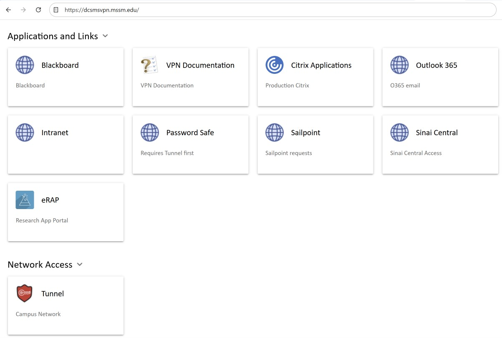
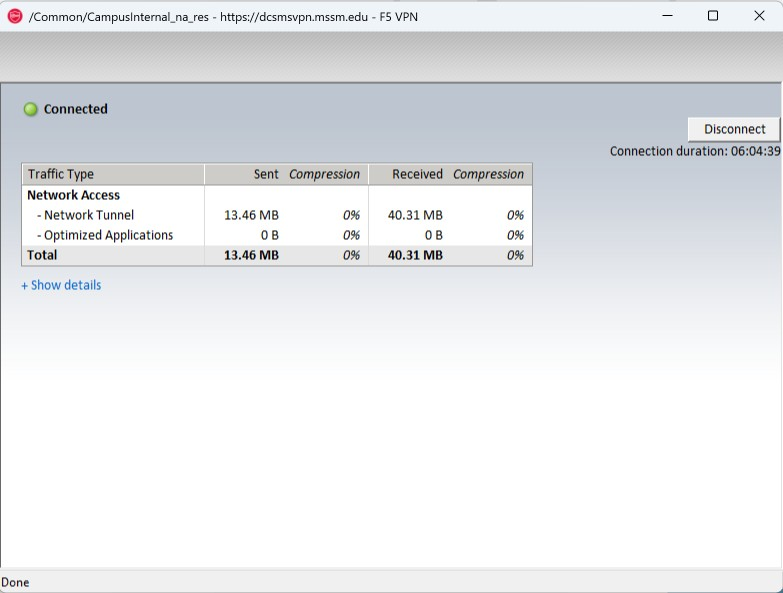
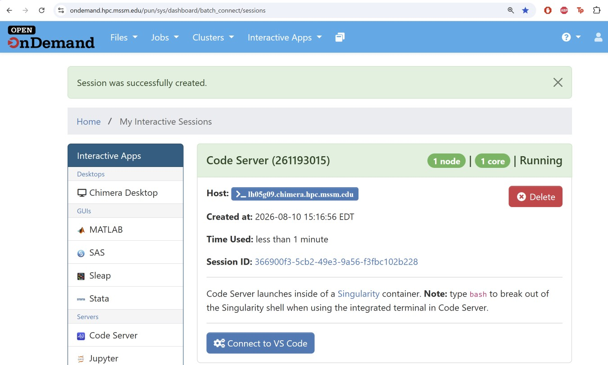
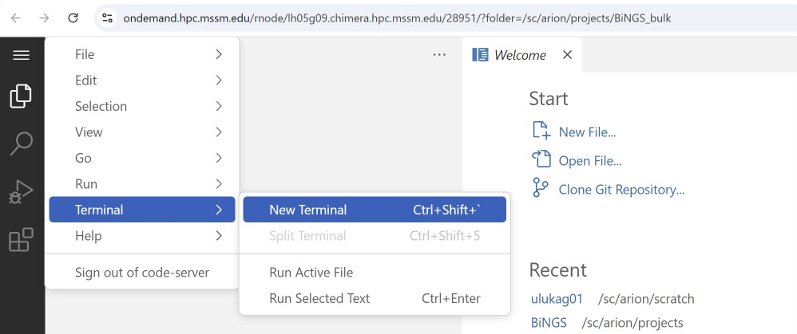

# Minerva

Everything you need to get onto Mount Sinai's HPC cluster (**Minerva**) and
launch an interactive environment for the course.

If it's your first time, read the sections below **top-to-bottom** — they're
ordered by what you have to do first. You'll only do steps 1–3 once;
steps 4 and 5 are what you'll repeat every time you sit down to work.

**Contents**

*Once — before the course starts:*

1. [Minerva account](#minerva-account) — most of you already have one and
   are already added to the course project.
2. [Set up Microsoft Authenticator](#set-up-microsoft-authenticator)
3. [One-time access check](#one-time-access-check) — two short steps that
   prove your access is live: create your own folder under the course
   project, then run a five-minute test job on the classroom nodes.

*Every time you want to work on the course:*

4. [Get onto the Sinai network](#get-onto-the-sinai-network) —
   [on-campus wifi](#on-campus-wifi-msmc-green) *or*
   [off-campus VPN](#off-campus-vpn)
5. [Using the reservation](#using-the-reservation) — what `BINGS_1` is,
   and why you should use it every time, not just on Wednesdays.
6. [Launch an OnDemand session](#launch-an-ondemand-session) —
   [Code Server](#ondemand-code-server) (bash / VS Code) *or*
   [RStudio Server](#ondemand-rstudio-server) (R)

> 📌 **The reservation `BINGS_1` is live right now and stays live
> continuously until the course ends** — from **Wed Sep 2, 3:55 PM** to
> **Wed Nov 12, 5:30 PM**. It is *not* switched on only during Wednesday
> class hours. Put `BINGS_1` in the OnDemand launch form's **Reservation
> ID** field whenever you work on the course — in session, on a Sunday
> evening, at 2 AM — and your job lands on the nodes we've set aside for
> the class instead of competing with the whole cluster. See
> [Using the reservation](#using-the-reservation).

## Minerva account

The course runs on Minerva, Mount Sinai's HPC cluster.

**Most of you are already set up.** We collected usernames over the
summer and Scientific Computing has added them to the course project. If
you gave us your Minerva username, you already have:

| What | Value |
|------|-------|
| Shared course folder | `/sc/arion/projects/BiNGS_bulk/` |
| LSF project account | `acc_BiNGS_bulk` |
| Classroom reservation | `BINGS_1` — live continuously Sep 2, 3:55 PM → Nov 12, 5:30 PM |

You don't need to do anything to request these — just confirm they work
with the [one-time access check](#one-time-access-check) below. That
check is how you find out whether something went wrong, so please don't
skip it.

**If you do NOT have a Minerva account yet:**

1. Request one at **[https://acctreq.hpc.mssm.edu](https://acctreq.hpc.mssm.edu)**.
   Accounts take several business days to provision, so do this today.
   *(If the request form won't load, you may need to be on the Sinai
   network first — see [Get onto the Sinai network](#get-onto-the-sinai-network).)*
2. Scientific Computing will email you your Minerva username when the
   request is processed.
3. Forward that username to **gulay.ulukaya@mssm.edu** and
   **dan.hasson@mssm.edu**. We then have to file a separate ticket to add
   you to the course project, which takes another day or so — so the
   sooner we have your username, the better.
4. We'll email you when your access is live. Then run the
   [one-time access check](#one-time-access-check).

Account creation, password resets and MFA problems are handled by
Scientific Computing at **hpchelp@hpc.mssm.edu**, not by the course
staff. Anything about the *course project* — folder access, the project
account, the reservation — is ours: open an
[Issue](../../issues) and we'll sort it out.

## Set up Microsoft Authenticator

Mount Sinai requires **multi-factor authentication (MFA)** on every login.
You will be prompted every single time you sign into **OnDemand** or the
**F5 VPN**, so set this up **before the course starts** — without it,
both will reject your login.

The supported app is **Microsoft Authenticator**. Follow the official
Mount Sinai guide:
**[https://itsecurity.mssm.edu/ms-authenticator/](https://itsecurity.mssm.edu/ms-authenticator/)**

The guide walks you through:

1. Installing the **Microsoft Authenticator** app on your phone (App Store
   or Google Play).
2. Registering your Mount Sinai account with the app so it can generate
   the approval codes / push notifications used on every login.

## One-time access check

This is the one thing we need every participant to do **before Session 1**.
It takes about five minutes and it is how we find out — while there's still
time to fix it — whether your access is actually working.

There are two parts. Part 1 proves you can reach the shared course folder.
Part 2 proves you can run a job on the classroom compute nodes. They test
different things, so please do both.

Reference: the official Minerva
[Logging in](https://labs.icahn.mssm.edu/minervalab/documentation/logging-in/)
and [Quick start](https://labs.icahn.mssm.edu/minervalab/minerva-quick-start/)
pages.

### Before you start

**1. Be on the Sinai network** — see
[Get onto the Sinai network](#get-onto-the-sinai-network) (on-campus
wifi or off-campus VPN). Skip ahead, do that step, then come back here.

**2. Open a terminal on your own laptop:**

- **Mac / Linux:** the built-in **Terminal** app (or iTerm2).
- **Windows:** the built-in **Windows Terminal** (Win 11 default; free
  from the Microsoft Store on Win 10) — it ships with OpenSSH, so the
  `ssh` command works out of the box. See the
  [official Minerva Logging in guide](https://labs.icahn.mssm.edu/minervalab/documentation/logging-in/)
  for setup instructions and screenshots.

**3. SSH into Minerva.** Replace `<your-minerva-username>` with the
username you were assigned:

```bash
ssh <your-minerva-username>@minerva.hpc.mssm.edu
```

*(If your Sinai email is `@mountsinai.org` rather than `@mssm.edu`, use
`minerva-org.hpc.mssm.edu` instead.)*

You'll be prompted for your **Sinai password**, then a **Microsoft
Authenticator** verification code (or push approval). Once you see a
`[<your-username>@li03c##]$` prompt, you're on Minerva.

> The password prompt shows **nothing at all** as you type — no dots, no
> asterisks. That's normal on Linux. Type it and press Enter.

### Part 1 — Claim your folder

Copy and paste this line, and press Enter:

```bash
cd /sc/arion/projects/BiNGS_bulk/ && mkdir -p $USER && cd $USER && echo "Welcome $USER" > welcome.txt && cat welcome.txt && pwd
```

You should see:

```
Welcome <your-minerva-username>
/sc/arion/projects/BiNGS_bulk/<your-minerva-username>
```

That folder is yours for the whole course — it's where your work will
live. Everyone can see everyone's folders, which is deliberate: it means
a TA can look at your files when you're stuck.

### Part 2 — Run a test job

Part 1 only proved you can reach the *folder*. Actual analysis runs on
compute nodes, through the job scheduler, on the reservation we've
booked for the class. This second step proves all of that works.

Still in your folder from Part 1, copy the whole block below — from
`cat` down to the final `EOF` — paste it, and press Enter:

```bash
cat > hello_minerva.lsf <<'EOF'
#!/bin/bash
#BSUB -J hello_minerva
#BSUB -P acc_BiNGS_bulk
#BSUB -q premium
#BSUB -U BINGS_1
#BSUB -n 1
#BSUB -W 00:05
#BSUB -R rusage[mem=2000]
#BSUB -o hello_minerva.%J.out
#BSUB -e hello_minerva.%J.err

echo "Hello from $(whoami)"
echo "Running on compute node: $(hostname)"
echo "Date: $(date)"
echo "My course folder: /sc/arion/projects/BiNGS_bulk/$USER"

module purge
module load R/4.2.0
Rscript -e 'cat("R is working:", R.version.string, "\n")'
EOF
```

That wrote a small job script. (It's also in this repo as
[`hello_minerva.lsf`](hello_minerva.lsf) if you'd rather read it first.)
Now submit it:

```bash
bsub < hello_minerva.lsf
```

You'll get back a job ID:

```
Job <268055683> is submitted to queue <premium>.
```

Check on it with `bjobs`. It usually finishes in under ten seconds, so
you may well see nothing at all — an empty `bjobs` means it's already
done, which is good news:

```bash
bjobs
```

Then read the output, substituting your own job ID:

```bash
cat hello_minerva.*.out
```

Near the bottom of that file, past LSF's resource-usage summary, you
should find:

```
Hello from <your-minerva-username>
Running on compute node: lc07e04     <- or lc07e05
Date: ...
My course folder: /sc/arion/projects/BiNGS_bulk/<your-minerva-username>
R is working: R version 4.2.0 (2022-04-22)
```

The file should also say **`Successfully completed.`** near the top.

If you see all of that, you're completely set up: account, project
folder, job scheduler, classroom reservation, and R. Nothing else to do
before Session 1.

### Part 3 — Log out

Type `exit` (or press **Ctrl-D**) to close the SSH session.

### If something fails

Please **don't sit on it** — the whole point of doing this a week early
is that we have time to fix it. Open an
[Issue](../../issues) with the exact error text, or bring it to the
optional help session before Session 2.

Common failures and what they mean:

| What you see | What it means | What to do |
|---|---|---|
| `ssh: Could not resolve hostname` | You're not on the Sinai network | Connect to MSMC-Green or the VPN, then retry |
| `Permission denied` after your password | Wrong username, or MFA not registered | Check your username; set up [Microsoft Authenticator](#set-up-microsoft-authenticator) |
| `-bash: cd: /sc/arion/projects/BiNGS_bulk/: No such file or directory` | You're on Minerva but not in the course project | Open an Issue — this one is ours to fix |
| `Permission denied` on `mkdir` | Same as above — you're not in the project group yet | Open an Issue |
| `User <you> is not a member of the specified user group` after `bsub` | You're in the folder group but not the reservation group | Open an Issue — this is a known half-provisioned state and we can get it fixed in a day |
| `Project account acc_BiNGS_bulk is not valid` | Typo, or you're not on the project | Check the spelling first, then open an Issue |
| `bjobs` shows `PEND` for a long time | The reservation is busy, or you're off-reservation | Usually fine — wait a minute. If it's still pending after five, tell us |

## Get onto the Sinai network

Before OnDemand can reach you, your laptop must be on the Mount Sinai
network. There are two ways in — **pick the one that matches where you
are**:

- On campus with a laptop → [On-campus wifi (MSMC-Green)](#on-campus-wifi-msmc-green)
- Anywhere else (home, off-site, café) → [Off-campus VPN](#off-campus-vpn)

### On-campus wifi (MSMC-Green)

The full Mount Sinai wifi guide (with per-device screenshots) is here:
**[Mount Sinai Wifi Instructions (PDF)](https://icahn.mssm.edu/files/ISMMS/Assets/About%20the%20School/Computer%20Services/Mount-Sinai-Wifi-Instructions.pdf)**

Quick version — the **username format depends on which side of Mount
Sinai you're affiliated with**:

| Affiliation | Username format | Example |
|-------------|-----------------|---------|
| **School** (Faculty, Staff, Students) | `mssmcampus\<your-username>` | `mssmcampus\doej01` |
| **Hospital** (Employees) | `msnyuhealth\<your-network-ID>` | `msnyuhealth\doej01` |

Steps:

1. In your device's wireless settings, connect to `MSMC-Green`.
2. When prompted, enter your username in the format above.
3. Enter your associated password.

Once you're on `MSMC-Green`, [OnDemand](https://ondemand.hpc.mssm.edu/)
reaches you directly — no VPN needed. Skip ahead to
[Launch an OnDemand session](#launch-an-ondemand-session).

### Off-campus VPN

If you are **not** on campus (working from home, off-site, etc.), you must
be on the Mount Sinai VPN before OnDemand can reach the cluster.

**One-time install** — install the F5 client for your operating system
before your first off-campus session:

- 🍎 **[F5 VPN tunnel for Mac](https://itsecurity.mssm.edu/vpn-tunnel-for-mac/)**
- 🪟 **[F5 VPN tunnel for Windows](https://itsecurity.mssm.edu/vpn-tunnel-for-windows/)**

Both guides walk you through downloading the installer from the Mount
Sinai portal and running it once so the F5 client is registered on your
machine.

**Every off-campus session** — connect through the tunnel:

1. Go to the VPN portal for your side of Mount Sinai:
   - **Hospital employees:** [https://msvpn.mountsinai.org](https://msvpn.mountsinai.org)
   - **School employees:** [https://dcsmsvpn.mssm.edu](https://dcsmsvpn.mssm.edu)
2. Log in with your Sinai credentials and approve the Microsoft
   Authenticator prompt.
3. Under **Network Access**, click **Tunnel** — this launches the F5 VPN
   client you installed above:

   

4. A separate F5 VPN client window opens. When the tunnel is up, the
   top-left indicator turns green and reads **Connected**, with a running
   Sent / Received traffic total and a **Disconnect** button on the right:

   

Leave that window open while you use OnDemand — closing it or clicking
**Disconnect** drops the tunnel.

## Using the reservation

We have booked two compute nodes exclusively for this course. The booking
is called a **reservation**, and its name is **`BINGS_1`**.

**It is live continuously for the whole course:**

| | |
|---|---|
| Starts | Wednesday **September 2, 3:55 PM** — already active |
| Ends | Wednesday **November 12, 5:30 PM** |
| Capacity | 192 CPU cores across two nodes (`lc07e04`, `lc07e05`) |

The most common misunderstanding is that the reservation only exists
during Wednesday class hours. **It doesn't.** It is one single unbroken
window running from the start date to the end date. A Saturday afternoon,
a Tuesday night, the week of Session 6 — it's all inside the window, and
`BINGS_1` works the whole time.

So: **use `BINGS_1` whenever you're working on the course.** You do not
need to check whether class is in session, and you do not need to leave
the field blank at other times.

### How to use it

**In OnDemand** — type `BINGS_1` into the **Reservation ID** field on the
Code Server or RStudio Server launch form.

**In a batch job** — add the `-U` line to your job script, as in
[`hello_minerva.lsf`](hello_minerva.lsf):

```bash
#BSUB -U BINGS_1
```

or pass it on the command line:

```bash
bsub -P acc_BiNGS_bulk -U BINGS_1 -q premium -n 4 -W 2:00 ./my_script.sh
```

### Why bother

Minerva is shared by the whole institution, and at busy times a job can
sit in the queue for a long while. Jobs submitted to `BINGS_1` go to
nodes that are held for this course, so they generally start immediately.
That's the difference between running a practice analysis in an evening
and giving up on it.

If you forget the reservation, nothing breaks — your job just goes into
the general queue like any other and may wait longer.

### One courtesy

The reservation is 192 cores shared between about thirty of you, which is
plenty for coursework but not unlimited. Two requests:

- If you're running something genuinely heavy or long — many samples, a
  multi-hour alignment, your own full dataset — please submit it to the
  general queue (just leave the reservation out) rather than parking it
  on the classroom nodes for hours.
- Close your OnDemand sessions when you're finished with them. An idle
  Code Server session holds its cores until it times out.

Neither of these applies to normal coursework. Run the exercises on the
reservation without a second thought.

## Launch an OnDemand session

OnDemand is Mount Sinai's browser-based interface to Minerva compute
nodes. Pick the app that matches what you'll do this session:

- **[Code Server](#ondemand-code-server)** — VS Code in the browser.
- **[RStudio Server](#ondemand-rstudio-server)** — RStudio in the
  browser.

Same portal, same login for both:
**[https://ondemand.hpc.mssm.edu/](https://ondemand.hpc.mssm.edu/)** —
sign in with your Minerva username + password and approve the Microsoft
Authenticator prompt.

### OnDemand Code Server

1. Under **Interactive Apps → Servers**, click **Code Server**.
2. Fill in the launch form 

   | Field | Value |
   |-------|-------|
   | Queue | `Premium` |
   | Project Account | `acc_BiNGS_bulk` (or your own lab's `acc_` account, if you'd rather bill your work there) |
   | Codeserver Version | `4.15` |
   | Working Directory | `/sc/arion/projects/BiNGS_bulk` (or wherever you want to work) |
   | Number of hours | `3` (or however long you want the session to stay alive) |
   | Number of cores | `4` |
   | Memory request (GB) | `16` |
   | **Reservation ID** | **`BINGS_1`** — any time between Sep 2 and Nov 12, not just during class |

3. Click **Launch** at the bottom.
4. Wait for the job status to flip to **Running**, then click **Connect
   to VS Code**:

   

5. Inside VS Code, click the three horizontal lines (☰) in the upper-left
   corner and choose **Terminal → New Terminal**:

   

You now have a shell running on a Minerva compute node inside your
browser.

### OnDemand RStudio Server

RStudio Server is the R IDE for the course's R-based sessions (Sessions 5
and 6). Same OnDemand portal — different app.

1. Under **Interactive Apps → Servers**, click **RStudio Server**.
2. Fill in the launch form:

   | Field | Value |
   |-------|-------|
   | Queue | `Premium` |
   | Project Account | `acc_BiNGS_bulk` |
   | Working Directory | `/sc/arion/projects/BiNGS_bulk` |
   | Number of hours | `3` |
   | Number of cores | `1` |
   | Memory request (GB) | `4` |
   | **Reservation ID** | **`BINGS_1`** — any time between Sep 2 and Nov 12, not just during class |

3. Click **Launch**, then **Connect to RStudio Server** when the job is
   running.
4. Inside RStudio, set your working directory to your own course
   subfolder:

   ```r
   setwd(file.path("/sc/arion/projects/BiNGS_bulk", Sys.getenv("USER")))
   ```
