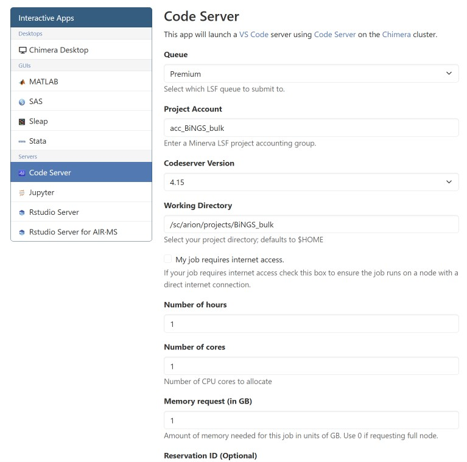

# Minerva

Everything you need to get onto Mount Sinai's HPC cluster (**Minerva**) and
launch an interactive environment for the course.

If it's your first time, read the sections below **top-to-bottom** — they're
ordered by what you have to do first. You'll only do steps 1–3 once;
steps 4 and 5 are what you'll repeat every time you sit down to work.

**Contents**

*Once — before the course starts:*

1. [Request a Minerva account](#request-a-minerva-account)
2. [Set up Microsoft Authenticator](#set-up-microsoft-authenticator)
3. [One-time access check](#one-time-access-check) — a one-line command
   that confirms everything works and creates your subfolder under the
   course project.

*Every time you want to work on the course:*

4. [Get onto the Sinai network](#get-onto-the-sinai-network) —
   [on-campus wifi](#on-campus-wifi-msmc-green) *or*
   [off-campus VPN](#off-campus-vpn)
5. [Launch an OnDemand session](#launch-an-ondemand-session) —
   [Code Server](#ondemand-code-server) (bash / VS Code) *or*
   [RStudio Server](#ondemand-rstudio-server) (R)

> 📌 **During sessions**, set the OnDemand launch form's **Reservation ID**
> to `BINGS_1` so your Code Server / RStudio job lands on the reserved
> classroom nodes. Outside sessions, leave the reservation field blank.

## Request a Minerva account

The course runs on Minerva. Every participant needs an active Minerva
account **before the course starts** — accounts take time to provision,
so do this as early as possible.

**If you don't already have a Minerva account:**

1. Request one at **[https://acctreq.hpc.mssm.edu](https://acctreq.hpc.mssm.edu)**.
2. You'll receive a notification once your request is processed, along
   with your Minerva username.
3. Email your Minerva username to **gulay.ulukaya@mssm.edu** and
   **dan.hasson@mssm.edu** so we can add you to the course project
   (`acc_BiNGS_bulk`) and its shared folder (`BiNGS_bulk`).

**If you already have a Minerva account:** skip step 1 and just email your
username to Gulay and Dan (step 3) so we can add you to the project.

Once you're in the project, your shared folder is at
`/sc/arion/projects/BiNGS_bulk/`. We will notify you when access is
active — verify with the [one-time access check](#one-time-access-check)
below.

## Set up Microsoft Authenticator

Mount Sinai requires **multi-factor authentication (MFA)** on every login.
You will be prompted every single time you sign into **OnDemand** or the
**F5 VPN**, so set this up **before the course starts** — without it,
both will reject your login.

The supported app is **Microsoft Authenticator**. Follow the official
Mount Sinai guide:
**[https://itsecurity.mssm.edu/ms-authenticator/](https://itsecurity.mssm.edu/ms-authenticator/)**

The guide walks you through:

1. Installing the **Microsoft Authenticator** app on your phone (App Store
   or Google Play).
2. Registering your Mount Sinai account with the app so it can generate
   the approval codes / push notifications used on every login.

## One-time access check

Once we've confirmed your Minerva username has been added to the course
project, run this one-time check from your **laptop's terminal** (not
OnDemand) to confirm access is live and create your own subfolder under
the shared course folder.

Reference: the official Minerva
[Logging in](https://labs.icahn.mssm.edu/minervalab/documentation/logging-in/)
and [Quick start](https://labs.icahn.mssm.edu/minervalab/minerva-quick-start/)
pages.

**1. Be on the Sinai network** — see
[Get onto the Sinai network](#get-onto-the-sinai-network) (on-campus
wifi or off-campus VPN). Skip ahead, do that step, then come back here.

**2. Open a terminal on your own laptop:**

- **Mac / Linux:** the built-in **Terminal** app (or iTerm2).
- **Windows:** the built-in **Windows Terminal** (Win 11 default; free
  from the Microsoft Store on Win 10) — it ships with OpenSSH, so the
  `ssh` command works out of the box. If you'd rather use a GUI-first
  SSH client, install **MobaXterm** or **PuTTY** — see the
  [official Minerva Logging in guide](https://labs.icahn.mssm.edu/minervalab/documentation/logging-in/)
  for setup instructions and screenshots.

**3. SSH into Minerva.** Replace `<your-minerva-username>` with the
username you were assigned:

```bash
ssh <your-minerva-username>@minerva.hpc.mssm.edu
```

*(If your Sinai email is `@mountsinai.org` rather than `@mssm.edu`, use
`minerva-org.hpc.mssm.edu` instead.)*

You'll be prompted for your **Sinai password**, then a **Microsoft
Authenticator** verification code (or push approval). Once you see a
`[<your-username>@li03c##]$` prompt, you're on Minerva.

**4. Run the one-liner** — copy and paste the line below and press Enter:

```bash
cd /sc/arion/projects/BiNGS_bulk/ && mkdir -p $USER && echo "Welcome $USER" > $USER/welcome.txt && ls && cat $USER/welcome.txt
```

`ls` should list the shared course folder including your
minerva-username folder, and the last line printed should be
`Welcome <your-minerva-username>`. If both are true, you're all set —
you have an account, you're in the course project, and you have your
own working folder at
`/sc/arion/projects/BiNGS_bulk/<your-minerva-username>/`.

**5. Log out** — type `exit` (or press **Ctrl-D**) to close the SSH
session.

If anything fails, open an [Issue](../../issues).

## Get onto the Sinai network

Before OnDemand can reach you, your laptop must be on the Mount Sinai
network. There are two ways in — **pick the one that matches where you
are**:

- On campus with a laptop → [On-campus wifi (MSMC-Green)](#on-campus-wifi-msmc-green)
- Anywhere else (home, off-site, café) → [Off-campus VPN](#off-campus-vpn)

### On-campus wifi (MSMC-Green)

The full Mount Sinai wifi guide (with per-device screenshots) is here:
**[Mount Sinai Wifi Instructions (PDF)](https://icahn.mssm.edu/files/ISMMS/Assets/About%20the%20School/Computer%20Services/Mount-Sinai-Wifi-Instructions.pdf)**

Quick version — the **username format depends on which side of Mount
Sinai you're affiliated with**:

| Affiliation | Username format | Example |
|-------------|-----------------|---------|
| **School** (Faculty, Staff, Students) | `mssmcampus\<your-username>` | `mssmcampus\doej01` |
| **Hospital** (Employees) | `msnyuhealth\<your-network-ID>` | `msnyuhealth\doej01` |

Steps:

1. In your device's wireless settings, connect to `MSMC-Green`.
2. When prompted, enter your username in the format above.
3. Enter your associated password.

Once you're on `MSMC-Green`, [OnDemand](https://ondemand.hpc.mssm.edu/)
reaches you directly — no VPN needed. Skip ahead to
[Launch an OnDemand session](#launch-an-ondemand-session).

### Off-campus VPN

If you are **not** on campus (working from home, off-site, etc.), you must
be on the Mount Sinai VPN before OnDemand can reach the cluster.

**One-time install** — install the F5 client for your operating system
before your first off-campus session:

- 🍎 **[F5 VPN tunnel for Mac](https://itsecurity.mssm.edu/vpn-tunnel-for-mac/)**
- 🪟 **[F5 VPN tunnel for Windows](https://itsecurity.mssm.edu/vpn-tunnel-for-windows/)**

Both guides walk you through downloading the installer from the Mount
Sinai portal and running it once so the F5 client is registered on your
machine.

**Every off-campus session** — connect through the tunnel:

1. Go to the VPN portal for your side of Mount Sinai:
   - **Hospital employees:** [https://msvpn.mountsinai.org](https://msvpn.mountsinai.org)
   - **School employees:** [https://dcsmsvpn.mssm.edu](https://dcsmsvpn.mssm.edu)
2. Log in with your Sinai credentials and approve the Microsoft
   Authenticator prompt.
3. Under **Network Access**, click **Tunnel** — this launches the F5 VPN
   client you installed above:

   

4. A separate F5 VPN client window opens. When the tunnel is up, the
   top-left indicator turns green and reads **Connected**, with a running
   Sent / Received traffic total and a **Disconnect** button on the right:

   

Leave that window open while you use OnDemand — closing it or clicking
**Disconnect** drops the tunnel.

## Launch an OnDemand session

OnDemand is Mount Sinai's browser-based interface to Minerva compute
nodes. Pick the app that matches what you'll do this session:

- **[Code Server](#ondemand-code-server)** — VS Code in the browser; use
  it for **shell / bash** work (Sessions 2 preprocessing, Session 4).
- **[RStudio Server](#ondemand-rstudio-server)** — RStudio in the
  browser; use it for **R** work (Sessions 5, 6).

Same portal, same login for both:
**[https://ondemand.hpc.mssm.edu/](https://ondemand.hpc.mssm.edu/)** —
sign in with your Minerva username + password and approve the Microsoft
Authenticator prompt.

### OnDemand Code Server

1. Under **Interactive Apps → Servers**, click **Code Server**.
2. Fill in the launch form (1 hr / 1 core / 1 GB is enough for quick
   file-management work; bump the last three for hands-on sessions):

   

   | Field | Quick check | During a session |
   |-------|-------------|------------------|
   | Queue | `Premium` | `Premium` |
   | Project Account | `acc_BiNGS_bulk` | `acc_BiNGS_bulk` |
   | Codeserver Version | `4.15` | `4.15` |
   | Working Directory | `/sc/arion/projects/BiNGS_bulk` | `/sc/arion/projects/BiNGS_bulk` |
   | Number of hours | `1` | `3` |
   | Number of cores | `1` | `4` |
   | Memory request (GB) | `1` | `16` |
   | Reservation ID | *(leave blank)* | `BINGS_1` |

3. Click **Launch** at the bottom.
4. Wait for the job status to flip to **Running**, then click **Connect
   to VS Code**:

   

5. Inside VS Code, click the three horizontal lines (☰) in the upper-left
   corner and choose **Terminal → New Terminal**:

   

You now have a shell running on a Minerva compute node inside your
browser.

### OnDemand RStudio Server

RStudio Server is the R IDE for the course's R-based sessions (Sessions 5
and 6). Same OnDemand portal — different app.

1. Under **Interactive Apps → Servers**, click **RStudio Server**.
2. Fill in the launch form:

   | Field | Value |
   |-------|-------|
   | Queue | `Premium` |
   | Project Account | `acc_BiNGS_bulk` |
   | Working Directory | `/sc/arion/projects/BiNGS_bulk` |
   | Number of hours | `3` |
   | Number of cores | `1` |
   | Memory request (GB) | `4` |
   | Reservation ID *(during session only, leave blank otherwise)* | `BINGS_1` |

3. Click **Launch**, then **Connect to RStudio Server** when the job is
   running.
4. Inside RStudio, set your working directory to your own course
   subfolder:

   ```r
   setwd(file.path("/sc/arion/projects/BiNGS_bulk", Sys.getenv("USER")))
   ```
